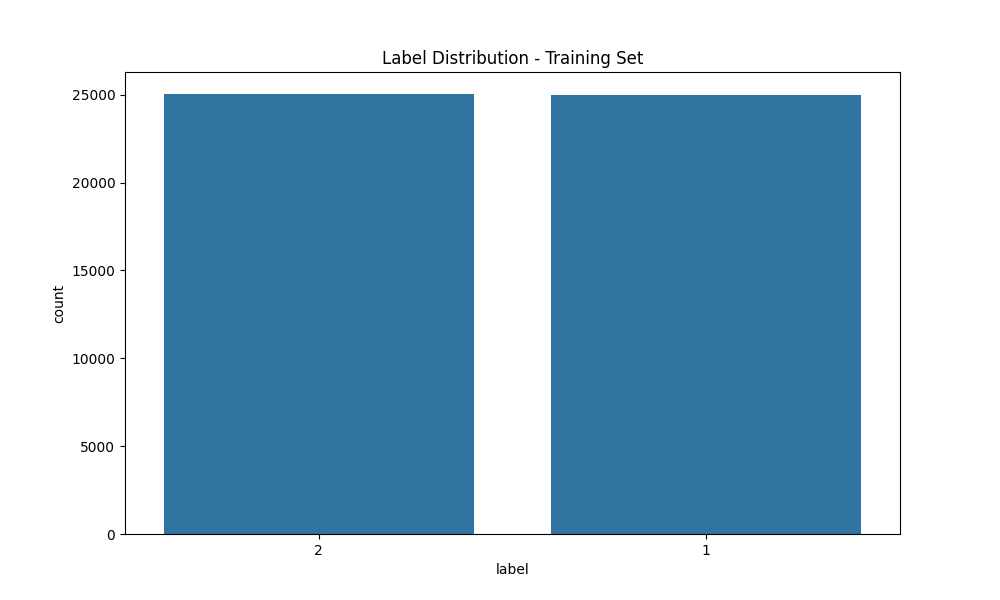
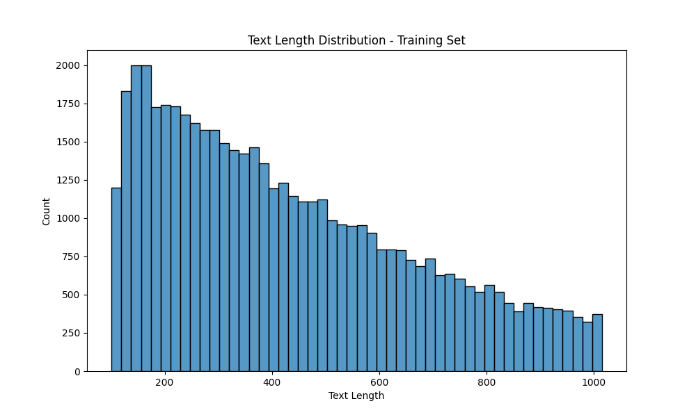
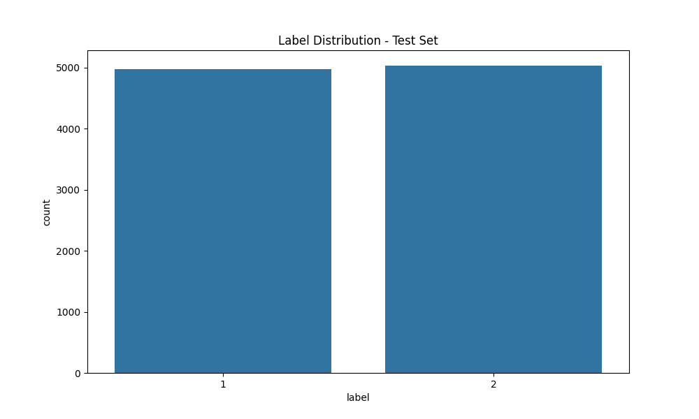
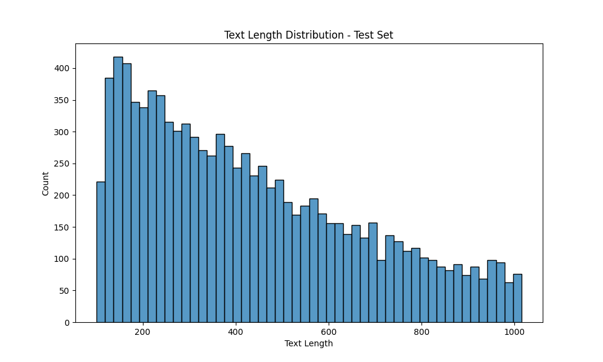

# Phương pháp TF-IDF trong phân tích cảm xúc

# Phân tích dữ liệu amazonreviews

## Tổng quan dữ liệu
Phân tích này tập trung vào bộ dữ liệu bittlingmayer/amazonreviews từ Kaggle, chứa các đánh giá sản phẩm Amazon ở định dạng FastText.

Bộ dữ liệu được chia thành hai tập:
- Tập huấn luyện: 50,000 đánh giá (review)
- Tập kiểm tra: 10,000 đánh giá

Dữ liệu được lưu trữ dưới dạng bảng (DataFrame) với 2 cột:
- Nhãn (label): Cảm xúc nhị phân (1 cho tiêu cực, 2 cho tích cực)
- Văn bản (text): Nội dung đánh giá

Dưới đây là 10 dòng đầu tiên của tập huấn luyện (số thứ tự chỉ để tham khảo, không phải là một phần của dữ liệu gốc):

| STT | Label | Text Preview |
|-----|-------|--------------|
| 1 | 2 | I haven't buy this, but...: In flames es la neta asì que aunque no tenga este cd sè q està chido, y ... |
| 2 | 1 | Would not recommend: I bought this printer two years ago and it seemed noisy and erratic from the be... |
| 3 | 1 | Former Dune Fan: OK - I am done with Dune. The original series, written by F. Herbert, was excellent... |
| 4 | 1 | The trailer fooled me for once.: This film was marketed like Stiller's return to good films. I saw m... |
| 5 | 1 | Did not like: I did not like this spray and gave it to a co-worker. I used it twice and had to stop.... |
| 6 | 1 | yuck: if one could synthesize all that is bad about the current music scene, the forlorn whining, th... |
| 7 | 1 | bland: Larry, as always, displays fine technical skill, fluency, and articulation, as well as the oc... |
| 8 | 1 | Devastatingly disappointing: The first two books take you on an amazing, wonderful rollercoaster rid... |
| 9 | 1 | DANGEROUS- plastic and wire screen ended up in drink: After juicing for years, I purchased this item... |
| 10 | 2 | Great tick repellent: For someone who has suffered through (if you ever really do) Lyme disease - th... |

## Phân tích tập huấn luyện

### Phân phối của nhãn (label)
- Đánh giá tích cực (positive) - nhãn 2: 25,042 (50.08%)
- Đánh giá tiêu cực (negative) - nhãn 1: 24,958 (49.92%)
- Bộ dữ liệu cân bằng tốt giữa đánh giá tích cực và tiêu cực



### Thống kê độ dài văn bản
- Độ dài trung bình: 431.61 ký tự (character)
- Độ dài tối thiểu: 101 ký tự
- Độ dài tối đa: 1,015 ký tự
- Độ dài trung vị: 382 ký tự
- Độ lệch chuẩn: 237.12 ký tự



### Về tần suất từ
20 từ xuất hiện thường xuyên nhất:
1. the (195,815 lần xuất hiện)
2. and (104,963)
3. i (100,372)
4. a (99,253)
5. to (94,760)
6. of (78,288)
7. this (69,990)
8. is (68,114)
9. it (65,933)
10. in (44,778)
11. for (42,790)
12. that (37,145)
13. was (32,862)
14. not (31,184)
15. you (29,163)
16. with (28,109)
17. but (27,215)
18. on (26,704)
19. have (25,549)
20. my (25,183)

## Tập kiểm thử

### Phân phối của nhãn (label)
- Đánh giá tích cực (nhãn 2): 5,031 (50.31%)
- Đánh giá tiêu cực (nhãn 1): 4,969 (49.69%)
- Cân bằng tương tự như tập huấn luyện



### Thống kê độ dài văn bản
- Độ dài trung bình: 431.52 ký tự
- Độ dài tối thiểu: 101 ký tự
- Độ dài tối đa: 1,015 ký tự
- Độ dài trung vị: 382 ký tự
- Độ lệch chuẩn: 238.94 ký tự



Các chỉ số này tương tự như tập huấn luyện, cho thấy tập kiểm tra cũng đại diện tốt cho tập huấn luyện.

# Về tần suất từ
20 từ xuất hiện thường xuyên nhất có phân phối tương tự như tập huấn luyện, với số lượng thấp hơn do kích thước tập dữ liệu nhỏ hơn.

## Nhận xét
1. **Dữ Liệu Cân Bằng**: Cả tập huấn luyện và tập kiểm tra đều có phân phối gần như bằng nhau giữa đánh giá tích cực và tiêu cực.
2. **Độ Dài Văn Bản Nhất Quán**: Phân phối độ dài văn bản rất giống nhau giữa tập huấn luyện và tập kiểm tra.
3. **Từ Thông Dụng**: Các từ xuất hiện thường xuyên nhất là các từ dừng (stop words) tiếng Anh thông thường, có thể cần được lọc bỏ trong quá trình tiền xử lý.
4. **Phạm Vi Độ Dài Văn Bản**: Các đánh giá tương đối ngắn gọn, hầu hết nằm trong khoảng 200-600 ký tự.
5. **Độ Dài Tối Thiểu**: Tất cả các đánh giá đều có ít nhất 101 ký tự, cho thấy đã có một số tiền xử lý hoặc lọc trên bộ dữ liệu gốc.

Dựa trên các thông tin trên, ta có thể sử dụng phương pháp TF-IDF để phân tích cảm xúc.

## Tổng quan phương pháp TF-IDF
TF-IDF (Term Frequency-Inverse Document Frequency) là một phương pháp thống kê để đánh giá tầm quan trọng của một từ trong một văn bản trong bộ dữ liệu. Trong phân tích cảm xúc, TF-IDF được sử dụng để chuyển đổi văn bản thành các vector số học, sau đó sử dụng các mô hình học máy để phân loại cảm xúc.

## Nguyên lý cốt lõi của TF-IDF

### 1. Term Frequency (TF)
- **Ý tưởng cốt lõi**: Một từ xuất hiện nhiều lần trong một văn bản có khả năng quan trọng đối với nội dung của văn bản đó
- **Ví dụ thực tế**: Trong một bài đánh giá sản phẩm, nếu từ "tuyệt vời" xuất hiện nhiều lần, nó có thể phản ánh cảm xúc tích cực mạnh mẽ
- **Hạn chế**: Một số từ phổ biến như "the", "is", "and" cũng xuất hiện nhiều lần nhưng không mang nhiều ý nghĩa

### 2. Inverse Document Frequency (IDF)
- **Ý tưởng cốt lõi**: Một từ xuất hiện trong nhiều văn bản khác nhau thì ít có khả năng phân biệt được nội dung
- **Ví dụ thực tế**: Từ "sản phẩm" xuất hiện trong hầu hết các bài đánh giá, nên nó không giúp phân biệt được cảm xúc
- **Công thức**: IDF = log(N/n), trong đó N là tổng số văn bản, n là số văn bản chứa từ đó
- **Tác dụng**: Giảm trọng số của các từ phổ biến và tăng trọng số của các từ hiếm

### 3. Kết Hợp TF và IDF
- **Tích hợp**: TF-IDF = TF × IDF
- **Ý nghĩa**:
```
                        TF CAO
                           ^
                           |
        +------------------+------------------+
        |                  |                  |
        |                  |                  |
        |                  |                  |
        |  Từ phổ biến     |   Từ phổ biến    |
        |  Không đặc trưng |   Đặc trưng      |
        |         (I)      |      (II)        |
        |                  |                  |
        +------------------+------------------+--> IDF CAO
        |                  |                  |
        |                  |                  |
        |        (III)     |       (IV)       |
        |  Ít gặp          |   Từ ít gặp      |
        |  Không đặc trưng |   Có thể         |
        |                  |   quan trọng     |
        |                  |                  |
        +------------------+------------------+
```

### 4. Ví dụ
```
Văn bản 1: "Sản phẩm này thật tuyệt vời, tôi rất thích"
Văn bản 2: "Sản phẩm này thật tệ, tôi không thích"

- "sản phẩm": TF cao nhưng IDF thấp (xuất hiện trong cả hai văn bản)
- "tuyệt vời": TF cao và IDF cao (chỉ xuất hiện trong văn bản tích cực)
- "tệ": TF cao và IDF cao (chỉ xuất hiện trong văn bản tiêu cực)
- "tôi": TF cao nhưng IDF thấp (xuất hiện trong cả hai văn bản)

                        TF CAO
                           ^
                           |
        +------------------+------------------+
        |                  |                  |
        |                  |                  |
        |                  |                  |
        |  "sản phẩm"      |   "tuyệt vời"    |
        |                  |                  |
        |  "tôi"           |   "tệ"           |
        |         (I)      |      (II)        |
        |                  |                  |
        +------------------+------------------+--> IDF CAO
        |                  |                  |
        |                  |                  |
        |        (III)     |       (IV)       |
        |                  |                  |
        |                  |                  |
        |                  |                  |
        |                  |                  |
        +------------------+------------------+
```

## Các bước thực hiện

### 1. Tiền xử lý dữ liệu
- Loại bỏ các ký tự đặc biệt và số
- Chuyển đổi các chữ viết hoa trong văn bản thành chữ thường
- Loại bỏ các từ dừng (stop words), là cá từ phổ biến không đặc trưng ứng với phần (I)
- Thực hiện stemming (rút gọn từ về dạng gốc), đây là đặc trưng của từ vựng tiếng Anh

### 2. Vector hoá TF-IDF
- Tính toán tần suất xuất hiện của từ (Term Frequency)
- Tính toán nghịch đảo tần suất tài liệu (Inverse Document Frequency)
- Tạo ma trận TF-IDF cho toàn bộ bộ dữ liệu

### 3. Huấn luyện mô hình
- Sử dụng Logistic Regression làm mô hình phân loại
- Tối ưu hóa các siêu tham số
- Đánh giá hiệu suất trên tập kiểm tra

## Ưu điểm
1. **Đơn giản và hiệu quả**: Dễ triển khai và cho kết quả tốt với dữ liệu vừa và nhỏ
2. **Chú trọng từ khoá**: Các từ quan trọng được đánh trọng số cao hơn
3. **Tính toán nhanh**: So với các phương pháp phức tạp hơn như BERT
4. **Ít tài nguyên**: Không yêu cầu GPU hoặc tài nguyên tính toán lớn

## Nhược điểm
1. **Mất thông tin thứ tự**: Không nắm bắt được thứ tự và ngữ cảnh của từ
2. **Không hiểu ngữ nghĩa**: Không hiểu được ý nghĩa sâu sắc của từ và cụm từ
3. **Kích thước vector lớn**: Có thể tạo ra vector có kích thước lớn với từ vựng phong phú
4. **Không xử lý từ mới**: Khó xử lý các từ chưa xuất hiện trong tập huấn luyện

## Kết quả thực nghiệm

### Hiệu suất mô hình
- **Độ chính xác (Accuracy)**: 90.20%
- **Precision**: 90% cho cả hai lớp
- **Recall**: 90% cho cả hai lớp
- **F1-score**: 90% cho cả hai lớp

### Bảng tiếp liên
```
[[2240  241]
 [ 249 2270]]
```
- Số lượng dự đoán đúng cho lớp tiêu cực: 2240 (âm tính thật)
- Số lượng dự đoán đúng cho lớp tích cực: 2270 (dương tính thật)
- Số lượng dự đoán sai: 490 (tổng số âm tính giả và dương tính giả)

### Các đặc trưng quan trọng

#### Top 10 từ cho cảm xúc tiêu cực:
1. not (-10.0368)
2. worst (-7.7351)
3. poor (-7.7138)
4. boring (-7.5704)
5. disappointing (-7.3227)
6. disappointed (-7.0534)
7. terrible (-6.2320)
8. waste (-6.1948)
9. disappointment (-6.0251)
10. bad (-5.9559)

#### Top 10 từ cho cảm xúc tích cực:
1. great (11.8309)
2. excellent (8.8899)
3. awesome (6.3015)
4. perfect (6.1588)
5. good (5.8318)
6. wonderful (5.5117)
7. love (5.4623)
8. best (5.4622)
9. amazing (4.8465)
10. easy (4.3918)

## Hiệu năng và tài nguyên

### Thời gian xử lý
- **Tổng thời gian chạy**: 43.00 giây
- **Thời gian huấn luyện mô hình**: 0.07 giây
- **Thời gian xử lý trung bình/comment**: ~0.0086 giây (43 giây / 5000 mẫu)

### Tài nguyên sử dụng
- **Bộ nhớ sử dụng**: 2122.83 MB
- **Kích thước mô hình**: 0.72 MB
  - Logistic Regression: 0.08 MB
  - TF-IDF Vectorizer: 0.65 MB

### Đánh giá hiệu năng
1. **Tốc độ**:
   - Huấn luyện nhanh (0.07 giây)
   - Xử lý realtime khả thi (~0.0086 giây/comment)
   - Phần lớn thời gian dành cho tiền xử lý dữ liệu

2. **Tài nguyên**:
   - Mô hình nhẹ (< 1MB)
   - Có thể triển khai trên các thiết bị có tài nguyên hạn chế

3. **Khả năng mở rộng**:
   - Có thể xử lý hàng trăm comment mỗi giây
   - Dễ dàng triển khai trên các server thông thường
   - Không yêu cầu phần cứng đặc biệt (GPU) 

### Đánh giá kết quả
1. **Điểm mạnh**:
   - Đạt độ chính xác cao (90.20%) với dữ liệu cân bằng
   - Các từ đặc trưng phản ánh đúng ngữ nghĩa cảm xúc
   - Mô hình ổn định với cả hai lớp (precision và recall tương đương)

2. **Điểm yếu**:
   - Vẫn có khoảng 10% dự đoán sai
   - Các trường hợp "trung tính" thường bị phân loại nhầm (ví dụ: "It's okay" bị phân loại là tiêu cực)
   - Phụ thuộc nhiều vào các từ khóa đơn lẻ

3. **Khả năng áp dụng**:
   - Phù hợp cho các bài toán phân loại cảm xúc đơn giản
   - Hiệu quả với dữ liệu có cấu trúc rõ ràng
   - Có thể triển khai trong môi trường có tài nguyên hạn chế

Nhìn chung, ta có thể đoán trước rằng khả năng ngôn ngữ của người dùng (đa số)
sẽ không thay đổi nhiều (cũng chừng đó từ khoá, cũng chừng đó cảm xúc, cũng chừng
đó lối diễn đạt, từ đặc trưng). Độ dài của các đánh giá (reviews) từ người dùng cũng
không thay đổi nhiều. Vì vậy, việc sử dụng TF-IDF để phân tích cảm xúc là một 
phương pháp vừa vừa đủ cho bài toán này. Tốc độ phân loại cảm xúc cực nhanh cho phép
ta nhanh chóng có cái nhìn tổng quan về cảm xúc của người dùng đối với sản phẩm.
Đồng thời, ở tốc độ cực nhanh thế này, ta có thể phát hiện ra các đánh giá tiêu cực
để nhanh chóng kích hoạt các phản ứng khác từ khía người quản lý/nhân viên trong
thời gian thực (real-time).
