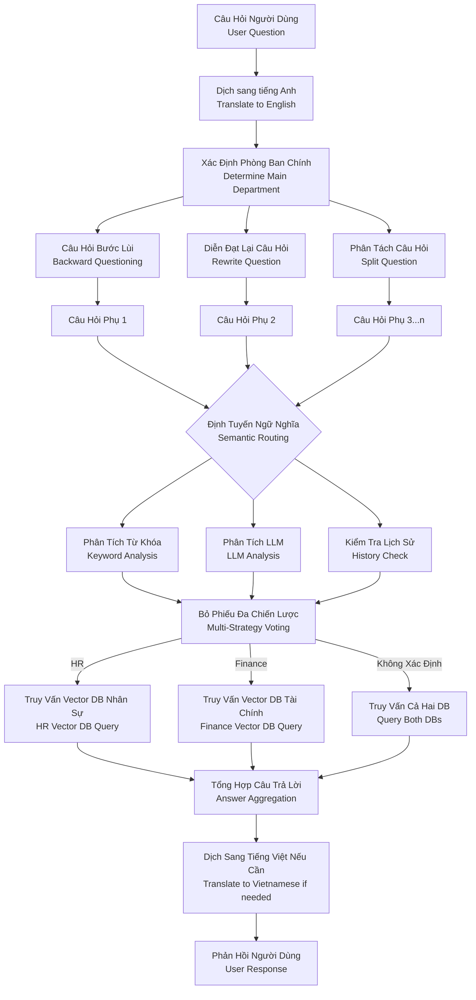

# Boss Assistant - Hệ Thống Trả Lời Câu Hỏi Thông Minh

## Tổng Quan
Boss Assistant là một hệ thống trả lời câu hỏi thông minh giúp người dùng lấy thông tin về các phòng ban Nhân sự và Tài chính. Hệ thống sử dụng các kỹ thuật AI tiên tiến bao gồm xử lý ngôn ngữ tự nhiên, cơ sở dữ liệu vector và tạo câu trả lời dựa trên thông tin được truy xuất để cung cấp các phản hồi chính xác và phù hợp với ngữ cảnh.

## Tính Năng Chính

### 1. Xử Lý Ngôn Ngữ
- **Dịch Thuật**: Tự động dịch câu hỏi không phải tiếng Anh sang tiếng Anh
- **Sửa Lỗi Ngữ Pháp**: Kiểm tra và sửa lỗi ngữ pháp trong văn bản tiếng Anh
- **Hỗ Trợ Đa Ngôn Ngữ**: Xử lý cả đầu vào tiếng Anh và tiếng Việt

### 2. Xử Lý Câu Hỏi
- **Câu Hỏi Bước Lùi**: Tạo câu hỏi tổng quát hơn để hiểu ngữ cảnh
- **Diễn Đạt Lại Câu Hỏi**: Làm rõ và cụ thể hóa câu hỏi
- **Phân Tách Câu Hỏi**: Chia nhỏ câu hỏi phức tạp thành các câu hỏi con đơn giản hơn

### 3. Cơ Sở Tri Thức
- **Cơ Sở Dữ Liệu Vector**: Sử dụng FAISS để tìm kiếm tương tự hiệu quả
- **Chia Nhỏ Tài Liệu**: Phân chia tài liệu thành các đoạn nhỏ
- **Tạo Embedding**: Tạo vector embedding sử dụng các mô hình của OpenAI

### 4. Tạo Câu Trả Lời
- **Câu Trả Lời Dựa Trên Truy Xuất**: Kết hợp truy xuất tài liệu với tạo câu trả lời bằng LLM
- **Câu Trả Lời Theo Phòng Ban**: Cung cấp câu trả lời chuyên biệt cho Nhân sự và Tài chính
- **Xử Lý Nhiều Câu Hỏi**: Xử lý và kết hợp câu trả lời cho các truy vấn phức tạp
- **Hiển Thị Các Bước Trung Gian**: Hiển thị quá trình suy luận trong quá trình thực thi

## Kiến Trúc Hệ Thống



## Quy Trình Xử Lý Câu Hỏi

Hệ thống xử lý câu hỏi theo quy trình đa bước, được tổ chức thành các mô-đun riêng biệt:

1. **Dịch Thuật** (text_processing.py):
   - Luôn dịch câu hỏi sang tiếng Anh để xử lý, bất kể ngôn ngữ đầu vào là gì
   - Hiển thị cả văn bản gốc và văn bản đã dịch để người dùng theo dõi

2. **Xử Lý Câu Hỏi Nâng Cao** (text_processing.py):
   - **Câu Hỏi Bước Lùi**: Tạo câu hỏi tổng quát hơn để hiểu ngữ cảnh rộng hơn
   - **Diễn Đạt Lại**: Làm rõ và cụ thể hóa câu hỏi gốc
   - **Phân Tách Câu Hỏi**: Chia nhỏ câu hỏi phức tạp thành các câu hỏi con đơn giản hơn

3. **Định Tuyến Thông Minh** (routing.py):
   - **Phân Tích Từ Khóa**: Sử dụng danh sách từ khóa từ các file hr_keywords.txt và finance_keywords.txt
   - **Phân Tích LLM**: Sử dụng mô hình ngôn ngữ để phân tích ngữ nghĩa và cung cấp độ tin cậy
   - **Kiểm Tra Lịch Sử**: Lưu trữ và sử dụng lịch sử định tuyến trước đó
   - **Bỏ Phiếu Đa Chiến Lược**: Kết hợp kết quả từ các chiến lược trên để đưa ra quyết định cuối cùng

4. **Truy Vấn Thông Tin** (data_processing.py):
   - Tạo và truy vấn cơ sở dữ liệu vector FAISS cho cả hai phòng ban
   - Xử lý các trường hợp đặc biệt khi không thể xác định rõ phòng ban

5. **Tổng Hợp Câu Trả Lời** (main.py):
   - Kết hợp các câu trả lời từ các câu hỏi phụ thành một câu trả lời hoàn chỉnh
   - Đảm bảo câu trả lời cuối cùng đầy đủ, mạch lạc và dễ hiểu

Quy trình này đảm bảo câu hỏi luôn được xử lý bởi phòng ban phù hợp nhất, tăng độ chính xác của câu trả lời mà không cần yêu cầu người dùng phải chỉ định phòng ban. Hệ thống hiển thị tất cả các bước xử lý trung gian, giúp người dùng hiểu rõ quá trình suy luận và đưa ra câu trả lời.

## Tổ Chức Mã Nguồn

Mã nguồn được tổ chức thành các thành phần mô-đun để dễ bảo trì hơn:

### Các File Python

- **main.py**:
  - Logic ứng dụng chính và giao diện người dùng
  - Xử lý câu hỏi chính và tổng hợp câu trả lời
  - Quản lý luồng chạy của ứng dụng

- **prompts.py**:
  - Tất cả các mẫu prompt được sử dụng trong ứng dụng
  - Tách riêng giúp dễ dàng chỉnh sửa và tùy biến

- **text_processing.py**:
  - Các hàm xử lý văn bản
  - Dịch thuật tự động
  - Các kỹ thuật xử lý câu hỏi nâng cao

- **data_processing.py**:
  - Đọc và xử lý dữ liệu từ file
  - Tạo và quản lý cơ sở dữ liệu vector
  - Phân tích từ khóa

- **routing.py**:
  - Logic định tuyến đa chiến lược
  - Hệ thống bỏ phiếu và tính điểm tin cậy
  - Quản lý lịch sử định tuyến

### Các File Dữ Liệu

- **hr_data.txt**: Dữ liệu về phòng Nhân sự
- **finance_data.txt**: Dữ liệu về phòng Tài chính
- **hr_keywords.txt**: Danh sách từ khóa liên quan đến Nhân sự
- **finance_keywords.txt**: Danh sách từ khóa liên quan đến Tài chính
- **requirements.txt**: Danh sách các thư viện cần thiết

## Thư Viện Cần Thiết
- langchain
- langchain-openai
- langchain-community
- faiss-cpu
- openai

## Cài Đặt
1. Cài đặt các thư viện cần thiết:
```bash
pip3 install -r requirements.txt
```

2. Thiết lập biến môi trường:
```bash
export OPENAI_API_KEY="your-openai-api-key"
```

3. Chạy ứng dụng:
```bash
python3 main.py
```