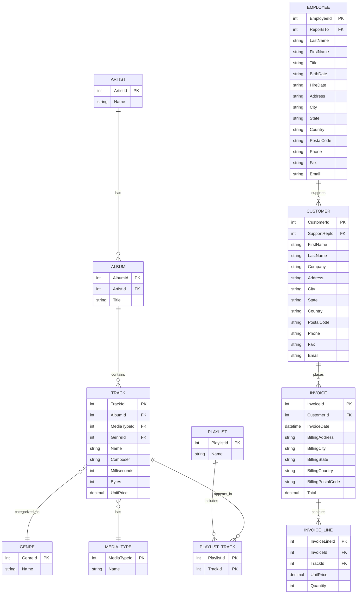

# Trợ lý Cơ sở dữ liệu Chinook

Một ứng dụng Streamlit cho phép người dùng truy vấn cơ sở dữ liệu Chinook bằng ngôn ngữ tự nhiên. Ứng dụng sử dụng LangChain và OpenAI để xử lý các câu hỏi bằng ngôn ngữ tự nhiên và chuyển đổi chúng thành các truy vấn SQL.

## Tính năng

- Truy vấn cơ sở dữ liệu Chinook bằng ngôn ngữ tự nhiên
- Tạo và thực thi truy vấn SQL theo thời gian thực
- Giao diện thân thiện với người dùng và các câu hỏi mẫu
- Xử lý lỗi và phản hồi thông tin
- Hỗ trợ đa ngôn ngữ (Việt-Anh)
- Logging chi tiết cho việc debug và theo dõi
- Xử lý và làm sạch truy vấn SQL tự động

## Lựa chọn công nghệ: SQLToolkit vs SQLDatabaseChain

Ứng dụng sử dụng SQLToolkit thay vì SQLDatabaseChain vì những lý do sau:

| Tính năng | SQLDatabaseChain | SQLToolkit (cho Agents) |
|-----------|------------------|------------------------|
| Tổng quan | Pipeline đơn giản: input → tạo SQL → thực thi → output | Bộ công cụ mà Agent có thể sử dụng để linh hoạt quyết định bước tiếp theo |
| Tính linh hoạt | Chỉ 1 lần thực thi: Câu hỏi → 1 truy vấn SQL → Câu trả lời | Lập luận nhiều bước: có thể lập kế hoạch, thực thi nhiều truy vấn, phân tích kết quả |
| Phù hợp với | Câu hỏi đơn giản ("Top 5 bài hát?") | Câu hỏi phức tạp hoặc không chắc chắn ("Tìm top 5 nghệ sĩ theo doanh thu, sau đó so sánh với doanh số bài hát") |
| Xử lý lỗi | Hạn chế (nếu SQL thất bại, nó sẽ thất bại) | Thông minh hơn: Agent có thể thử lại, suy nghĩ lại, điều chỉnh truy vấn |
| Bảo mật | Cần điều chỉnh prompt cẩn thận | Agent vẫn cần bảo vệ nhưng có thể tự sửa lỗi tốt hơn |
| Hiệu suất | Nhanh hơn, đơn giản hơn | Hơi chậm hơn, nhưng thông minh hơn |

## Kiến trúc hệ thống

Luồng xử lý của ứng dụng được mô tả như sau:

```
[Giao diện Web Streamlit]
        ↓
[Câu hỏi từ người dùng]
        ↓
[Dịch sang tiếng Anh bằng GPT-4]
        ↓
[LangChain SQLAgent (sử dụng SQLToolkit)]
        ↓
[Thực thi SQL trên Chinook.db]
        ↓
[Kết quả + Định dạng câu trả lời từ GPT-4]
        ↓
[Dịch câu trả lời sang tiếng Việt]
        ↓
[Hiển thị câu trả lời trên Streamlit]
```

### Chi tiết triển khai

1. **Giao diện Web Streamlit**:
   - Sử dụng Streamlit để tạo giao diện web đơn giản và thân thiện
   - Hỗ trợ nhập câu hỏi bằng tiếng Việt
   - Hiển thị câu hỏi đã dịch và kết quả tìm kiếm
   - Cung cấp các câu hỏi mẫu để tham khảo

2. **Xử lý ngôn ngữ tự nhiên**:
   - Sử dụng GPT-4 để dịch câu hỏi từ tiếng Việt sang tiếng Anh
   - Giữ nguyên các tên riêng, số liệu và thuật ngữ kỹ thuật khi dịch
   - Xử lý các biến thể ngôn ngữ và ngữ cảnh

3. **SQL Agent và Toolkit**:
   - Sử dụng SQLToolkit của LangChain để tạo agent thông minh
   - Tự động làm sạch và chuẩn hóa truy vấn SQL
   - Hỗ trợ xử lý lỗi và thử lại khi cần
   - Ghi log chi tiết các bước thực thi

4. **Cơ sở dữ liệu**:
   - Sử dụng SQLite với cơ sở dữ liệu Chinook
   - Hỗ trợ các truy vấn phức tạp và đa bảng
   - Tối ưu hóa hiệu suất truy vấn

5. **Xử lý lỗi và Logging**:
   - Ghi log chi tiết các bước xử lý
   - Bắt và xử lý các ngoại lệ
   - Hiển thị thông báo lỗi thân thiện với người dùng


## Cài đặt

1. Cài đặt các thư viện cần thiết:
   ```bash
   pip3 install -r requirements.txt
   ```
2. Tạo file `.env` trong thư mục gốc của dự án và thêm khóa API OpenAI của bạn:
   ```
   OPENAI_API_KEY=khóa_api_của_bạn
   ```
3. Đảm bảo file `Chinook.db` nằm trong thư mục gốc của dự án

## Cách sử dụng

1. Đảm bảo môi trường ảo đã được kích hoạt (nếu bạn đã tạo)
2. Khởi chạy ứng dụng Streamlit:
   ```bash
   python3 -m streamlit run chinook.py
   ```
3. Mở trình duyệt web và truy cập URL hiển thị trong terminal (thường là http://localhost:8501)
4. Nhập câu hỏi của bạn bằng tiếng Việt về cơ sở dữ liệu Chinook

## Ví dụ về câu hỏi

- Khách hàng nào đã chi tiêu nhiều tiền nhất?
- Nghệ sĩ nào có nhiều album nhất?
- 5 thể loại nhạc bán chạy nhất là gì?
- Khách hàng nào đã chi tiêu nhiều tiền nhất trong năm 2013?
- Có bao nhiêu bài hát thuộc thể loại Rock?
- Liệt kê tất cả các album của một nghệ sĩ cụ thể

## Cấu trúc cơ sở dữ liệu

Cơ sở dữ liệu Chinook chứa các bảng sau:
- Albums
- Artists
- Customers
- Employees
- Genres
- InvoiceItems
- Invoices
- MediaTypes
- Playlists
- PlaylistTrack
- Tracks

