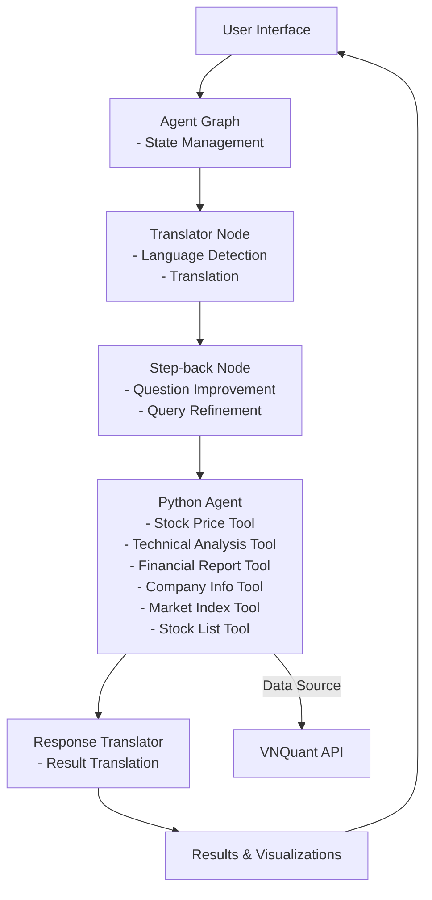
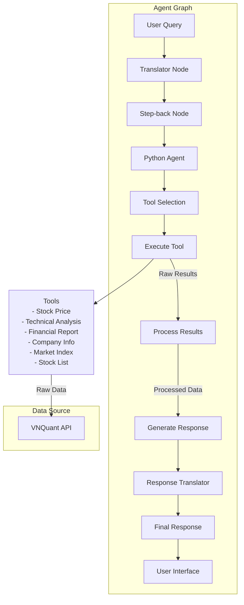

# Stock Quant

A comprehensive toolkit for financial analysis and trading, built with Python. This application provides various tools for stock market analysis, including price data collection, technical indicators, financial reports, and AI-powered analysis.

## Features

### 1. Stock Data Collection
- Real-time and historical stock price data using VNQuant API
- Market index tracking
- Company information retrieval
- Stock list management

### 2. Technical Analysis
- Multiple technical indicators calculation using pandas-ta
- Customizable timeframes
- Visual representation of indicators using Plotly
- Support for various technical analysis patterns

### 3. Financial Reports
- Comprehensive financial statement analysis
- Business performance metrics
- Cash flow analysis
- Basic financial indices
- Automated report generation

### 4. AI-Powered Analysis
- Natural language processing for queries using LangChain
- Automated report generation
- Intelligent data interpretation
- Python agent for calculations and analysis
- Multi-step workflow with language translation and question improvement

## Architecture

The application follows a modular architecture with the following components:

- Data Collection Layer
- Analysis Layer
- AI Agent Layer
- User Interface Layer

## System Architecture



### System Flow

1. **Initial Processing**:
   - Translator Node detects and translates non-English queries
   - Step-back Node improves question quality and clarity
   - Python Agent handles all analysis and data retrieval

2. **Data Retrieval Flow**:
   - Python Agent uses VNQuant API for real-time and historical data
   - Data is cached in memory during the session for performance

3. **Tool Execution**:
   - Python Agent tools process and analyze data:
     - Stock Price Tool: Retrieves and processes price data
     - Technical Analysis Tool: Calculates indicators and patterns
     - Financial Report Tool: Analyzes company financials
     - Company Info Tool: Retrieves company details
     - Market Index Tool: Tracks market indices
     - Stock List Tool: Manages stock listings

4. **Result Generation**:
   - Processed data is formatted for presentation
   - Visualizations are generated for complex data
   - Insights and recommendations are synthesized
   - Results are translated back to original language if needed
   - Final results are returned to the user interface

5. **User Presentation**:
   - Results are displayed in the user interface
   - Interactive visualizations allow for data exploration
   - User can refine queries based on initial results

This architecture ensures:
- Efficient data retrieval from VNQuant API
- Comprehensive analysis of market data
- User-friendly presentation of results
- Support for multiple languages
- High-quality question processing

## LangGraph Architecture

The application uses LangGraph to orchestrate the workflow between different components. The following diagram illustrates the flow of data and control:



The LangGraph architecture consists of several key components:

1. **Translator Node**: Handles language detection and translation
2. **Step-back Node**: Improves question quality and clarity
3. **Python Agent**: Handles analysis tasks and tool execution
4. **Tool Selection**: Determines which tools to use based on the task
5. **Tool Execution**: Runs the selected tools and processes their results
6. **Response Translator**: Translates results back to original language if needed
7. **Response Generation**: Combines results into a coherent response

### Result Processing Flow

After a tool is executed, the results go through the following processing steps:

1. **Tool Execution Results**:
   - Raw data from VNQuant API
   - Technical analysis calculations
   - Financial metrics and indicators
   - Company information

2. **Result Processing**:
   - Data validation and error checking
   - Format standardization
   - Calculation of derived metrics
   - Data aggregation when needed

3. **Response Generation**:
   - Natural language interpretation of results
   - Contextual analysis of the data
   - Generation of insights and recommendations
   - Formatting for user presentation
   - Translation to original language if needed

4. **Final Output**:
   - Structured response with key findings
   - Visualizations (charts, graphs) when appropriate
   - Supporting data and metrics
   - Actionable insights and recommendations

The workflow is designed to be flexible and extensible, allowing for easy addition of new tools and processing steps as needed. Each step in the result processing flow can be customized or extended to handle specific types of analysis or data formats.

## File Structure

```
stock-quant/
├── data/
│   └── raw/
├── src/
│   ├── agents/
│   │   ├── agent_graph.py
│   │   ├── agent_types.py
│   │   └── python_agent_node.py
│   ├── tools/
│   │   ├── tools.py
│   │   ├── data_collector.py
│   │   ├── finance_report.py
│   │   └── tech_analysis.py
│   └── utils/
│       ├── config.py
│       └── helpers.py
├── tests/
├── requirements.txt
└── README.md
```

## Setup and Installation

1. Clone the repository:
```bash
git clone <repository-url>
cd stock-quant
```

2. Create and activate a virtual environment:
```bash
python -m venv venv
source venv/bin/activate  # On Windows: venv\Scripts\activate
```

3. Install dependencies:
```bash
pip install -r requirements.txt
```