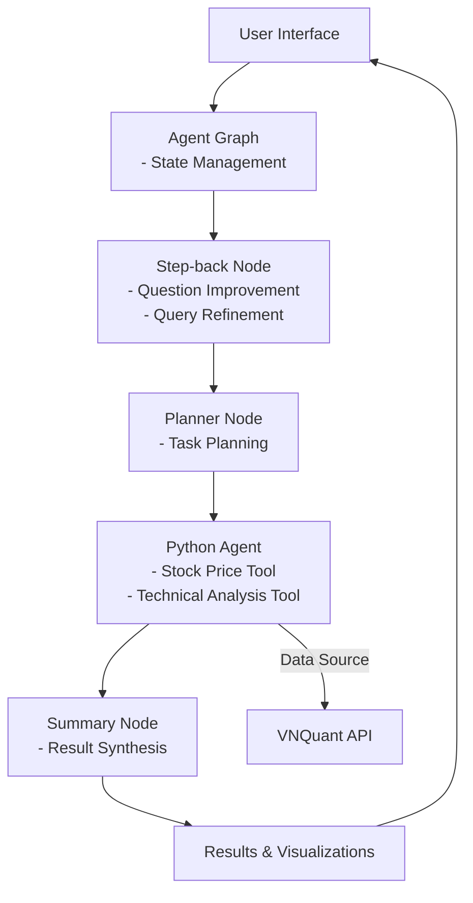

# Stock Quant

A comprehensive toolkit for financial analysis and trading, built with Python. This application provides various tools for stock market analysis, including price data collection and technical indicators.

## Features

### 1. Stock Data Collection
- Real-time and historical stock price data using VNQuant API
- Customizable date ranges for data retrieval

### 2. Technical Analysis
- Multiple technical indicators calculation using pandas-ta
- Support for various indicators:
  - Simple Moving Average (SMA)
  - Relative Strength Index (RSI)
  - Moving Average Convergence Divergence (MACD)
  - Bollinger Bands
- Customizable timeframes
- Visual representation of indicators

### 3. AI-Powered Analysis
- Natural language processing for queries using LangChain
- Automated analysis and interpretation
- Python agent for calculations and analysis
- Multi-step workflow with question improvement

## Architecture

The application follows a modular architecture with the following components:

- Data Collection Layer
- Analysis Layer
- AI Agent Layer
- User Interface Layer

## System Architecture



### System Flow

1. **Initial Processing**:
   - Step-back Node improves question quality and clarity
   - Planner Node determines the analysis approach
   - Python Agent handles all analysis and data retrieval

2. **Data Retrieval Flow**:
   - Python Agent uses VNQuant API for real-time and historical data
   - Data is cached in memory during the session for performance

3. **Tool Execution**:
   - Python Agent tools process and analyze data:
     - Stock Price Tool: Retrieves and processes price data
     - Technical Analysis Tool: Calculates indicators and patterns

4. **Result Generation**:
   - Processed data is formatted for presentation
   - Visualizations are generated for complex data
   - Insights and recommendations are synthesized
   - Final results are returned to the user interface

5. **User Presentation**:
   - Results are displayed in the user interface
   - Interactive visualizations allow for data exploration
   - User can refine queries based on initial results

This architecture ensures:
- Efficient data retrieval from VNQuant API
- Comprehensive analysis of market data
- User-friendly presentation of results
- High-quality question processing

## File Structure

```
stock-quant/
├── data/
│   └── raw/
├── src/
│   ├── agents/
│   │   ├── agent_graph.py
│   │   ├── agent_types.py
│   │   └── node_python_agent.py
│   ├── tools/
│   │   ├── tools.py
│   │   ├── data_collector.py
│   │   └── tech_analysis.py
│   └── utils/
│       ├── config.py
│       └── helpers.py
├── tests/
├── requirements.txt
└── README.md
```

## Example Queries:
- Show me the stock price of VNM for the last 10 days
- Calculate the RSI for VNM over the last month
- Show me the MACD analysis for VNM
- What are the Bollinger Bands for VNM?
- Get the SMA for VNM over the last 30 days
