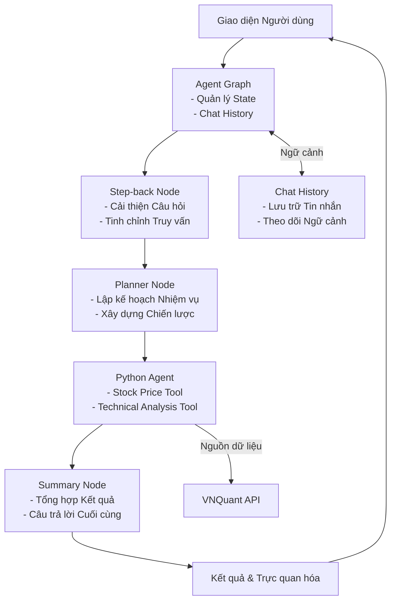

# Stock Quant

Một bộ công cụ toàn diện cho phân tích tài chính và giao dịch, được xây dựng bằng Python. Ứng dụng này cung cấp nhiều công cụ khác nhau cho phân tích thị trường chứng khoán, bao gồm thu thập dữ liệu giá, các chỉ báo kỹ thuật và phân tích dựa trên AI.

## Tính năng

### 1. Thu thập dữ liệu chứng khoán
- Dữ liệu giá chứng khoán thời gian thực và lịch sử sử dụng VNQuant API
- Phạm vi ngày tùy chỉnh để lấy dữ liệu

### 2. Phân tích kỹ thuật
- Tính toán nhiều chỉ báo kỹ thuật sử dụng pandas-ta
- Hỗ trợ các chỉ báo:
  - Simple Moving Average (SMA)
  - Relative Strength Index (RSI)
  - Moving Average Convergence Divergence (MACD)
  - Bollinger Bands
- Khung thời gian tùy chỉnh

### 3. Phân tích dựa trên AI
- Xử lý ngôn ngữ tự nhiên cho các truy vấn sử dụng LangChain
- Quy trình làm việc đa agent với các node chuyên biệt:
  - Step-back Node: Cải thiện chất lượng và độ rõ ràng của câu hỏi
  - Planner Node: Xác định phương pháp phân tích
  - Python Agent: Xử lý tính toán và truy xuất dữ liệu
  - Summary Node: Tổng hợp kết quả
- Lịch sử chat tương tác cho phản hồi theo ngữ cảnh
- Phản hồi streaming với các bước trung gian

## Kiến trúc

Ứng dụng tuân theo kiến trúc mô-đun với các thành phần sau:

### 1. Lớp Agent Graph
- Quản lý trạng thái sử dụng `AgentState`
- Điều phối quy trình làm việc với `StateGraph`
- Xử lý và streaming tin nhắn

### 2. Lớp Node
- Step-back Node: Cải thiện câu hỏi
- Planner Node: Lập kế hoạch và phân tách nhiệm vụ
- Python Agent Node: Phân tích dữ liệu và thực thi công cụ
- Summary Node: Tổng hợp kết quả

### 3. Lớp Tool
- Stock Price Tool: Truy xuất và xử lý dữ liệu
- Technical Analysis Tool: Tính toán chỉ báo
- Data Collector: Tích hợp API và lưu trữ

### 4. Cơ chế Lịch sử Chat
Hệ thống duy trì lịch sử chat tinh vi với các tính năng:
- Bảo toàn ngữ cảnh cuộc trò chuyện qua nhiều tương tác
- Lưu trữ cả tin nhắn người dùng và phản hồi của agent
- Theo dõi các bước trung gian và thực thi công cụ
- Cho phép phản hồi theo ngữ cảnh
- Sử dụng `InMemoryChatMessageHistory` để quản lý phiên (session)
- Hỗ trợ streaming các bước trung gian và câu trả lời cuối cùng

## Kiến trúc Hệ thống



## Cấu trúc Tệp

```
stock-quant/
├── app.py                    # Điểm khởi đầu chính của ứng dụng
├── agent_graph.py           # Điều phối quy trình làm việc
├── agent_types.py           # Định nghĩa trạng thái và kiểu
├── node_python_agent.py     # Triển khai Python agent
├── node_planner.py          # Triển khai node lập kế hoạch
├── node_step_back.py        # Node cải thiện câu hỏi
├── node_summary.py          # Triển khai node tổng hợp
├── tools.py                 # Triển khai các công cụ
├── data_collector.py        # Tiện ích thu thập dữ liệu
├── tech_analysis.py         # Các hàm phân tích kỹ thuật
├── config.py                # Cài đặt cấu hình
├── requirements.txt         # Các phụ thuộc
└── README.md                # Tài liệu
```

## Ví dụ Truy vấn:
- Show me the stock price of VNM in the last 10 days
- Calculate the technical indicators of HAG
- Calculate RSI for VNM in the last month
- Show me the MACD analysis for VNM
- What are the Bollinger Bands for VNM?
- What is the SMA for VNM in the last 30 days?

## Tính năng Lịch sử Chat
Hệ thống lịch sử chat cung cấp:
1. **Context preservation**: Duy trì ngữ cảnh cuộc trò chuyện qua nhiều tương tác
2. **Intermediate steps**: Theo dõi và hiển thị quá trình suy luận
3. **Tool execution logs**: Ghi lại tất cả các lệnh gọi công cụ và kết quả
4. **Session management**: Xử lý nhiều phiên trò chuyện
5. **Streaming support**: Cập nhật thời gian thực tiến trình phân tích
