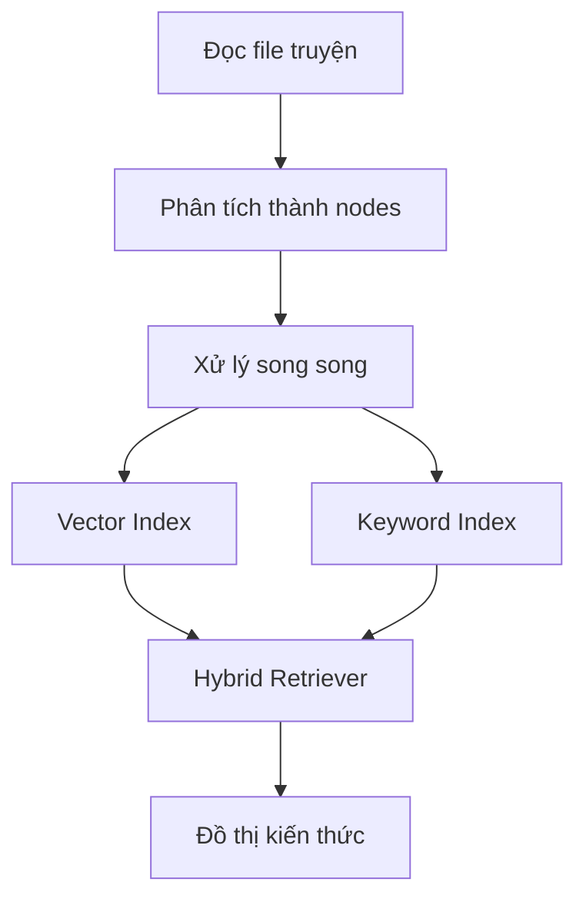
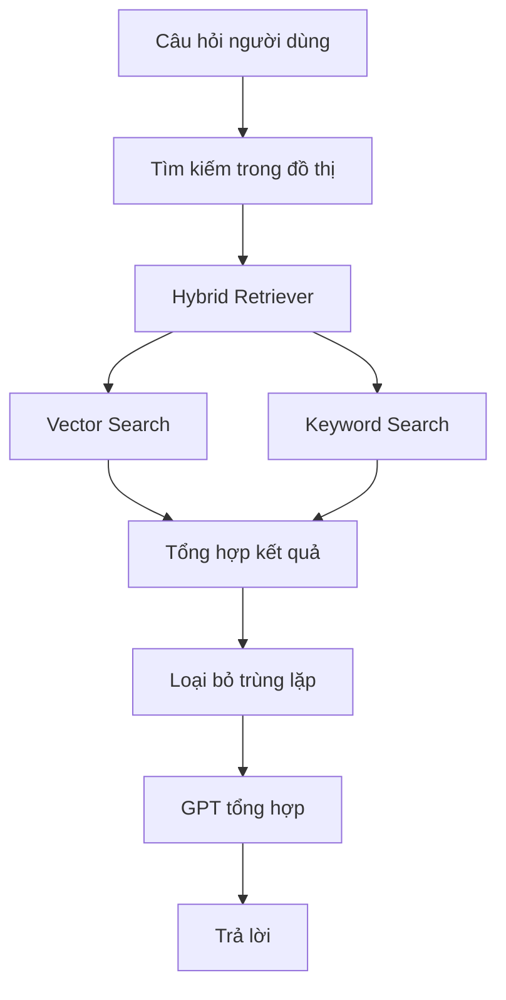

# 📚 Chatbot Truyện Việt (Graph-powered)

Một chatbot thông minh sử dụng RAG (Retrieval-Augmented Generation) và đồ thị kiến thức để trả lời các câu hỏi về truyện Việt Nam.

## 🏗️ Cấu trúc dự án

```
.
├── main.py              # File chính chứa logic chatbot và giao diện Gradio
├── story_indexer.py     # Module xử lý và index hóa truyện
├── books/              # Thư mục chứa các file truyện (.txt)
├── storage/           # Thư mục lưu trữ các chỉ mục vector
└── .env               # File chứa các biến môi trường (OPENAI_API_KEY)
```

## 🔄 Quy trình xử lý

### Quy trình Index hóa


### Quy trình Query và Tổng hợp


## 🚀 Tính năng chính

- **Xử lý văn bản thông minh**: 
  - Sử dụng LlamaIndex để phân tích và xử lý các file truyện
  - Chia nhỏ văn bản thành các node với chunk_size=512 và overlap=50
  - Xử lý song song với multiprocessing để tăng hiệu suất

- **Hệ thống tìm kiếm hybrid**:
  - Kết hợp Vector Search và Keyword Search
  - Tự động loại bỏ kết quả trùng lặp
  - Hỗ trợ tìm kiếm trong một truyện cụ thể hoặc tất cả truyện

- **Đồ thị kiến thức**:
  - Tạo và quản lý đồ thị kiến thức giữa các truyện
  - Sử dụng ComposableGraph để kết nối các chỉ mục
  - Cho phép tìm kiếm thông minh giữa các truyện

- **Giao diện chat**:
  - Sử dụng Gradio để tạo giao diện chat thân thiện
  - Hỗ trợ chọn truyện cụ thể hoặc tìm kiếm toàn bộ
  - Hiển thị debug information và kết quả tìm kiếm

## ⚙️ Cài đặt

1. Cài đặt các thư viện cần thiết:
```bash
pip install -r requirements.txt
```

2. Tạo file `.env` và thêm API key của OpenAI:
```
OPENAI_API_KEY=your_api_key_here
```

3. Tạo thư mục `books` và thêm các file truyện (.txt) vào đó

## 🎯 Cách sử dụng

1. Chạy file main.py:
```bash
python main.py
```

2. Truy cập giao diện web được tạo bởi Gradio (thường là http://localhost:7860)

3. Nhập câu hỏi và chọn truyện muốn tìm kiếm (hoặc "Tất cả truyện")

## 🔧 Cấu hình

Các thông số có thể điều chỉnh trong code:

- `OPENAI_MODEL`: Model GPT được sử dụng (mặc định: "gpt-4.1-mini")
- `EMBEDDING_MODEL`: Model embedding được sử dụng (mặc định: "text-embedding-3-small")
- `BATCH_SIZE`: Số lượng nodes trong mỗi batch xử lý (mặc định: 10)
- `CHUNK_SIZE`: Kích thước mỗi đoạn văn bản (mặc định: 512)
- `CHUNK_OVERLAP`: Độ chồng lấp giữa các đoạn (mặc định: 50)

## 📝 Ví dụ sử dụng

- "Kể tóm tắt câu chuyện"
- "Ai là nhân vật chính trong truyện?"
- "Có những nhân vật nào trong truyện?"
- "Triệu Sách là nhân vật trong truyện nào?"

## 🔍 Chi tiết kỹ thuật

1. **Xử lý văn bản**:
   - Sử dụng SimpleNodeParser để chia nhỏ văn bản
   - Mỗi node chứa metadata về nguồn và tên truyện
   - Xử lý song song với multiprocessing để tối ưu hiệu suất

2. **Hệ thống tìm kiếm**:
   - Vector Search: Sử dụng OpenAI Embedding để tìm kiếm ngữ nghĩa
   - Keyword Search: Sử dụng KeywordTableIndex để tìm kiếm từ khóa
   - Hybrid Retriever: Kết hợp cả hai phương pháp và loại bỏ trùng lặp

3. **Đồ thị kiến thức**:
   - Mỗi truyện được đại diện bởi một vector index
   - ComposableGraph kết nối các index thành một đồ thị
   - Cho phép tìm kiếm thông minh giữa các truyện

4. **Xử lý câu hỏi**:
   - Phân tích câu hỏi và tìm kiếm thông tin liên quan
   - Sắp xếp kết quả theo độ liên quan
   - Sử dụng GPT để tổng hợp câu trả lời dựa trên ngữ cảnh 