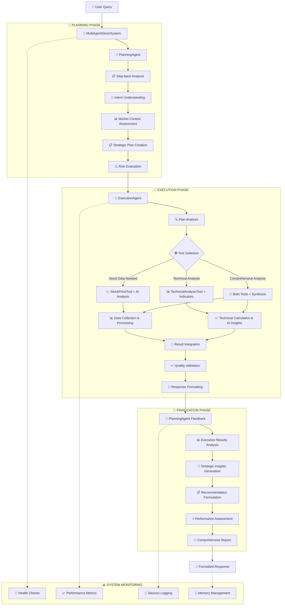

# Hệ Thống Phân Tích Cổ Phiếu Việt Nam Multi-Agent

Hệ thống phân tích cổ phiếu Việt Nam tiên tiến sử dụng kiến trúc multi-agent với LlamaIndex framework, OpenAI LLM và chuyên môn hóa từng agent để cung cấp phân tích chuyên sâu về thị trường chứng khoán Việt Nam.

## 🏗️ **Kiến Trúc Multi-Agent**

### **Tổng Quan Hệ Thống**
```
📊 Hệ Thống Phân Tích Cổ Phiếu Việt Nam Multi-Agent
│
├── 🤖 MultiAgentStockSystem (Điều Phối Viên Chính)
│   ├── 🧠 PlanningAgent (Chuyên Gia Lập Kế Hoạch)
│   ├── 🚀 ExecutionAgent (Chuyên Gia Thực Thi)
│   └── 🛠️ Công Cụ Chuyên Biệt
│       ├── 📈 StockPriceTool (AI-powered Stock Data)
│       └── 📊 TechnicalAnalysisTool (Advanced Technical Indicators)
│
├── ⚙️ Cấu Hình & Quản Lý
│   ├── AgentConfig (Cấu hình tập trung)
│   ├── DataCollector (Thu thập dữ liệu VNQuant)
│   └── Logger (Hệ thống logging)
│
└── 🖥️ Giao Diện
    └── Streamlit App (Chat interface với real-time metrics)
```

### **Chuyên Môn Của Các Agent**

| Agent | Chức Năng Chính | Khả Năng Đặc Biệt |
|-------|-----------------|-------------------|
| 🧠 **PlanningAgent** | Step-back analysis & Strategic planning | Hiểu ý định user, tạo kế hoạch thực thi, đánh giá rủi ro, adaptive planning |
| 🚀 **ExecutionAgent** | Tool coordination & Data synthesis | Điều phối tools, tích hợp kết quả, tool output capture, memory management |
| 🤖 **MultiAgentStockSystem** | System orchestration | Session management, performance metrics, health monitoring, response formatting |

## 🔄 **Workflow Multi-Agent**



## 📁 **Cấu Trúc Dự Án**

```
vietnamese-stock-multi-agent/
│
├── 🎯 **Multi-Agent Core System**
│   ├── multi_agent_system.py          # Main orchestrator với session management
│   ├── agent_planning.py              # Planning specialist với strategic analysis
│   ├── agent_execution.py             # Execution specialist với tool coordination
│   └── agent_config.py                # Centralized configuration management
│
├── 🛠️ **AI-Powered Tools**
│   ├── llama_tool_stock_price.py      # Stock data tool với OpenAI analysis
│   └── llama_tool_technical_analysis.py # Technical indicators với AI insights
│
├── 📊 **Data Infrastructure**
│   ├── data_collector.py              # Base data collection từ VNQuant
│   ├── llama_data_collector.py        # Enhanced collector với caching
│   ├── tech_analysis.py               # Technical analysis utilities
│   └── llama_types.py                 # Type definitions cho tools
│
├── 🖥️ **User Interface**
│   └── app.py                          # Streamlit app với chat interface
│
├── ⚙️ **Configuration & Utilities**
│   ├── config.py                      # System configuration
│   ├── logger.py                      # Logging utilities
│   └── __init__.py                    # Package initialization
│
├── 📋 **Documentation & Setup**
│   ├── README.md                      # This documentation
│   ├── requirements.txt               # Dependencies
│   └── .env.example                   # Environment template
│
└── 📦 **External Dependencies**
    ├── vnquant/                       # Vietnamese stock data library
    └── example_stock_data.py          # Usage examples
```

### **Core Components Chi Tiết**

| Component | Mô Tả Chi Tiết | Framework/Tech |
|-----------|----------------|----------------|
| `MultiAgentStockSystem` | Orchestrator chính, quản lý agents, session tracking, metrics | LlamaIndex, OpenAI |
| `PlanningAgent` | Strategic planning với ChatMemoryBuffer, step-back analysis | ReActAgent, GPT-4o-mini |
| `ExecutionAgent` | Tool coordination, output capture, memory management | ReActAgent, Tool orchestration |
| `StockPriceTool` | VNQuant data + OpenAI analysis, formatted tables, AI insights | BaseTool, VNQuant, OpenAI |
| `TechnicalAnalysisTool` | pandas-ta indicators + AI interpretation, trading signals | BaseTool, pandas-ta, OpenAI |
| `DataCollector` | VNQuant integration với caching, multi-symbol support | VNQuant CAFE/VND APIs |
| `AgentConfig` | Dataclass-based config với environment variable support | dataclasses, python-dotenv |

## 🚀 **Hướng Dẫn Cài Đặt & Sử Dụng**

### **1. Cài Đặt Dependencies**
```bash
# Clone repository
git clone <repository-url>
cd vietnamese-stock-multi-agent

# Install dependencies
pip install -r requirements.txt
```

### **2. Cấu Hình Environment**
```bash
# Tạo file .env
cp .env.example .env

# Chỉnh sửa .env với API key
OPENAI_API_KEY=your_openai_api_key_here
LLM_MODEL=gpt-4o-mini
LLM_TEMPERATURE=0.7
MEMORY_TOKEN_LIMIT=2000
ENABLE_LOGGING=true
LOG_LEVEL=INFO
```

### **3. Chạy Ứng Dụng**
```bash
# Khởi động Streamlit app
streamlit run app.py

# Hoặc test trực tiếp với Python
python -c "
from multi_agent_system import MultiAgentStockSystem
from agent_config import AgentConfig

config = AgentConfig.from_env()
system = MultiAgentStockSystem(api_key=config.openai_api_key)
response = system.process_query('Phân tích cổ phiếu VIC')
print(response)
"
```

### **4. Usage Examples**
```python
from multi_agent_system import MultiAgentStockSystem
from agent_config import AgentConfig

# Initialize system
config = AgentConfig.from_env()
system = MultiAgentStockSystem(api_key=config.openai_api_key)

# Get planning insights only
plan = system.get_planning_insights("Phân tích VIC technical indicators")

# Execute custom plan
results = system.execute_custom_plan(plan, "Custom VIC analysis")

# System monitoring
stats = system.get_system_stats()
health = system.health_check()

# Memory management
system.clear_system_memory()
```

## ⚙️ **Cấu Hình Hệ Thống**

### **AgentConfig Parameters**
```python
@dataclass
class AgentConfig:
    # API Configuration
    openai_api_key: str = os.getenv("OPENAI_API_KEY", "")
    
    # LLM Configuration
    llm_model: str = "gpt-4o-mini"              # Cost-effective model
    llm_temperature: float = 0.7                # Balance creativity/accuracy
    llm_max_tokens: int = 1000                  # Response length limit
    
    # Memory Configuration
    memory_token_limit: int = 2000              # Context window size
    max_session_history: int = 100              # Session retention
    
    # Agent Specialization
    planning_temperature: float = 0.7           # Creative planning
    execution_temperature: float = 0.5          # Accurate execution
    
    # Performance Settings
    max_response_time: float = 30.0             # Timeout protection
    max_retries: int = 3                        # Error resilience
    
    # Vietnamese Stock Market
    supported_symbols: list = [                 # Major VN stocks
        "HAG", "VIC", "FPT", "VNM", "MSN",
        "VCB", "BID", "CTG", "TCB", "MBB", 
        "VNINDEX"
    ]
```

### **Environment Variables**
```bash
# Required
OPENAI_API_KEY=your_openai_api_key

# Optional Customization
LLM_MODEL=gpt-4o-mini                    # Model selection
LLM_TEMPERATURE=0.7                      # Response creativity
LLM_MAX_TOKENS=1000                      # Response length
MEMORY_TOKEN_LIMIT=2000                  # Agent memory size
ENABLE_LOGGING=true                      # System logging
LOG_LEVEL=INFO                           # Log verbosity
```

## 🛠️ **Công Cụ AI-Powered**

### **📈 StockPriceTool**
- **Data Source**: VNQuant library (CAFE/VND APIs)
- **AI Enhancement**: OpenAI analysis của price trends và market insights
- **Supported Symbols**: VIC, FPT, VNM, HAG, MSN, TCB, VCB, BID, CTG, MBB, VNINDEX,...
- **Output Format**: 
  - Recent 10 Trading Days table
  - Performance metrics
  - AI-generated investment insights
  - Risk assessment

**Tool Capabilities:**
```python
# Automatic symbol detection và date range handling
input: "VIC" -> gets recent stock data với AI analysis
input: {"symbol": "FPT", "start_date": "2024-01-01", "end_date": "2024-06-30"}
output: Formatted tables + AI insights trong Vietnamese
```

### **📊 TechnicalAnalysisTool**
- **Indicators**: SMA_20, RSI_14, MACD, Bollinger Bands
- **Library**: pandas-ta cho accurate calculations
- **AI Enhancement**: OpenAI interpretation của technical signals
- **Trading Signals**: Buy/sell recommendations với risk warnings

**Technical Capabilities:**
```python
# Flexible input handling
input: "HAG" -> fetches data + calculates all indicators
input: stock_data_from_previous_tool -> direct calculation
output: 
  - Latest Technical Indicators table
  - Recent 5 Days Technical Indicators  
  - AI trading signal analysis
  - Support/resistance levels
```

## 💡 **Sample Queries & Use Cases**

### **📈 Stock Price Analysis**
- Cho biết stock data của mã VIC từ 2024-01-01 đến 2024-06-30,
- Lấy dữ liệu giá cổ phiếu FPT trong 3 tháng gần nhất, 
- Hiển thị performance của VNM trong năm 2024,
- Phân tích xu hướng giá cổ phiếu VNINDEX,
- So sánh giá đóng cửa của HAG và MSN
