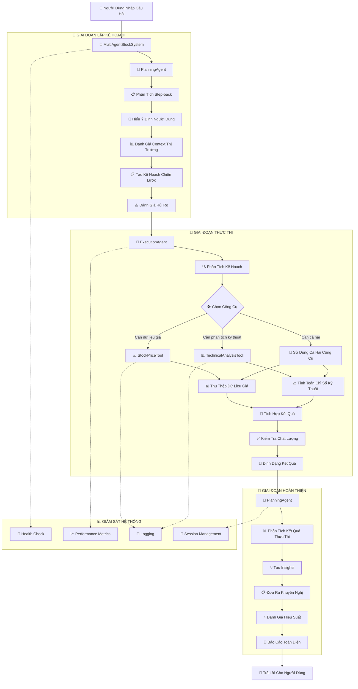

# Hệ Thống Phân Tích Cổ Phiếu Việt Nam Multi-Agent

Hệ thống phân tích cổ phiếu Việt Nam tiên tiến sử dụng kiến trúc multi-agent với AI-powered analysis, strategic planning và tool coordination chuyên nghiệp.

## 🏗️ **Kiến Trúc Multi-Agent**

### **Tổng Quan Hệ Thống**
```
📊 Hệ Thống Phân Tích Cổ Phiếu Việt Nam
├── 🤖 MultiAgentStockSystem (Điều Phối Viên)
│   ├── 🧠 PlanningAgent (Chuyên Gia Lập Kế Hoạch)
│   ├── 🚀 ExecutionAgent (Chuyên Gia Thực Thi) 
│   └── 🛠️ Công Cụ Phân Tích
│       ├── 📈 StockPriceTool (Công Cụ Giá Cổ Phiếu)
│       └── 📊 TechnicalAnalysisTool (Công Cụ Phân Tích Kỹ Thuật)
├── ⚙️ AgentConfig (Quản Lý Cấu Hình)
└── 🖥️ Streamlit App (Giao Diện Người Dùng)
```

### **Chuyên Môn Của Các Agent**

| Agent | Chức Năng Chính | Chuyên Môn |
|-------|----------------|------------|
| 🧠 **PlanningAgent** | Phân tích step-back & Lập kế hoạch chiến lược | Phân tích ý định, Tạo kế hoạch, Đánh giá rủi ro |
| 🚀 **ExecutionAgent** | Điều phối công cụ & Tổng hợp dữ liệu | Thực thi công cụ, Tích hợp kết quả, Định dạng đầu ra |
| 🤖 **MultiAgentStockSystem** | Điều phối hệ thống | Quản lý agent, Quản lý phiên làm việc, Giám sát sức khỏe |

## 🔄 **Sơ Đồ Phối Hợp Làm Việc Giữa Agents và Tools**



### **Chi Tiết Workflow**

1. **🎯 Giai Đoạn Lập Kế Hoạch**
   - Phân tích câu hỏi của người dùng
   - Hiểu ý định và context
   - Tạo kế hoạch chiến lược từng bước
   - Đánh giá rủi ro và constraints

2. **🚀 Giai Đoạn Thực Thi**
   - Phân tích và hiểu kế hoạch
   - Chọn công cụ phù hợp
   - Thu thập và xử lý dữ liệu
   - Kiểm tra và định dạng kết quả

3. **🔄 Giai Đoạn Hoàn Thiện**
   - Tổng hợp và phân tích kết quả
   - Tạo insights và khuyến nghị
   - Đánh giá hiệu suất
   - Tạo báo cáo toàn diện

## 📁 **Cấu Trúc Dự Án**

```
he-thong-phan-tich-co-phieu-vn/
├── 🎯 **Hệ Thống Multi-Agent Cốt Lõi**
│   ├── multi_agent_system.py      # Điều phối viên chính
│   ├── agent_planning.py          # Chuyên gia lập kế hoạch
│   ├── agent_execution.py         # Chuyên gia thực thi
│   └── agent_config.py            # Quản lý cấu hình
│
├── 🛠️ **Công Cụ Phân Tích**
│   ├── llama_tool_stock_price.py      # Công cụ lấy dữ liệu giá
│   └── llama_tool_technical_analysis.py # Công cụ phân tích kỹ thuật
│
├── 🖥️ **Giao Diện Người Dùng**
│   └── app.py                     # Ứng dụng Streamlit
│
├── 📊 **Dữ Liệu & Phân Tích**
│   ├── data_collector.py          # Thu thập dữ liệu cơ bản
│   ├── llama_data_collector.py    # Thu thập dữ liệu nâng cao
│   ├── tech_analysis.py           # Tiện ích phân tích kỹ thuật
│   └── finance.py                 # Xử lý dữ liệu tài chính
│
├── ⚙️ **Cấu Hình & Tiện Ích**
│   ├── config.py                  # Cấu hình hệ thống
│   ├── logger.py                  # Tiện ích logging
│   ├── llama_types.py            # Định nghĩa kiểu dữ liệu
│   └── __init__.py               # Khởi tạo package
│
├── 📋 **Tài Liệu & Thiết Lập**
│   ├── README.md                  # File này
│   ├── requirements.txt           # Dependencies
│   └── .env.example              # Template biến môi trường
│
└── 🧪 **Ví Dụ & Kiểm Thử**
    ├── example_stock_data.py      # Ví dụ sử dụng
    └── tests/                     # Test cases
```

### **Mô Tả Các File Quan Trọng**

| File | Mô Tả | Vai Trò |
|------|-------|---------|
| `multi_agent_system.py` | Điều phối viên hệ thống | Quản lý agents, điều phối phiên làm việc |
| `agent_planning.py` | Chuyên gia lập kế hoạch | Phân tích chiến lược, tạo kế hoạch |
| `agent_execution.py` | Chuyên gia thực thi | Điều phối công cụ, tổng hợp dữ liệu |
| `agent_config.py` | Quản lý cấu hình | Cài đặt tập trung |
| `llama_tool_stock_price.py` | Công cụ dữ liệu cổ phiếu | Lấy dữ liệu giá với phân tích AI |
| `llama_tool_technical_analysis.py` | Công cụ phân tích kỹ thuật | Chỉ số kỹ thuật với insights AI |
| `app.py` | Giao diện Streamlit | Tương tác người dùng và hiển thị |

## 💡 **Ví Dụ Câu Hỏi**

### **📈 Phân Tích Giá Cổ Phiếu**
```
"Xin stock data của mã VIC từ 2024-01-01 đến 2024-06-30"
"Lấy dữ liệu giá cổ phiếu FPT trong 3 tháng gần nhất"
"Hiển thị performance của VNM trong năm 2024"
"So sánh giá đóng cửa của HAG và MSN"
"Phân tích xu hướng giá cổ phiếu VNINDEX"
"Cho tôi xem biến động giá VCB trong tuần này"
```

### **📊 Phân Tích Kỹ Thuật**
```
"Tính RSI cho mã VIC với period 14 ngày"
"Phân tích MACD của FPT trong 2 tháng qua"
"Xem Bollinger Bands của VNM với period 20"
"Technical analysis toàn diện cho mã HAG"
"Tính SMA 20 và SMA 50 cho TCB"
"Chỉ số kỹ thuật nào đang báo hiệu mua cho BID?"
```

### **🎯 Phân Tích Toàn Diện**
```
"Phân tích toàn diện cổ phiếu VIC bao gồm price và technical"
"Đánh giá đầu tư cho mã FPT với timeframe 6 tháng"
"So sánh technical indicators giữa VNM và MSN"
"Tạo báo cáo phân tích chi tiết cho VNINDEX"
"Khuyến nghị mua/bán cho cổ phiếu HAG dựa trên technical analysis"
"Đưa ra strategy đầu tư cho nhóm cổ phiếu ngân hàng"
```

### **🔍 Nghiên Cứu Thị Trường**
```
"Cổ phiếu nào đang có RSI oversold trong danh sách VIC, FPT, VNM?"
"Phân tích correlation giữa VNINDEX và các large cap"
"Tìm signals mua/bán từ MACD của top banking stocks"
"So sánh performance YTD của nhóm cổ phiếu technology"
"Cổ phiếu nào đang breakout khỏi Bollinger Bands?"
"Phân tích sentiment thị trường dựa trên volume trading"
```

## 🚀 **Hướng Dẫn Nhanh**

### 1. **Cài Đặt**
```bash
git clone <repository-url>
cd he-thong-phan-tich-co-phieu-vn
pip install -r requirements.txt
```

### 2. **Thiết Lập Môi Trường**
```bash
# Tạo file .env
echo "OPENAI_API_KEY=your_openai_api_key" > .env
```

### 3. **Chạy Ứng Dụng**
```bash
streamlit run app.py
```

### 4. **Kiểm Thử Hệ Thống Multi-Agent**
```python
from multi_agent_system import MultiAgentStockSystem
from agent_config import AgentConfig

# Khởi tạo hệ thống
config = AgentConfig.from_env()
system = MultiAgentStockSystem(api_key=config.openai_api_key)

# Kiểm thử câu hỏi
response = system.process_query("Phân tích cổ phiếu VIC")
print(response)
```

## ⚙️ **Cấu Hình**

### **Biến Môi Trường**
```bash
# Bắt buộc
OPENAI_API_KEY=your_openai_api_key

# Tùy chọn
LLM_MODEL=gpt-4o-mini                # Model mặc định
LLM_TEMPERATURE=0.7                  # Độ sáng tạo trong phản hồi
MEMORY_TOKEN_LIMIT=2000              # Giới hạn memory agent
ENABLE_LOGGING=true                  # Bật logging hệ thống
LOG_LEVEL=INFO                       # Mức độ chi tiết logging
```

### **Cấu Hình Hệ Thống**
```python
# agent_config.py - Các thiết lập quan trọng
llm_model: str = "gpt-4o-mini"          # Nhanh và tiết kiệm chi phí
planning_temperature: float = 0.7       # Lập kế hoạch sáng tạo
execution_temperature: float = 0.5      # Thực thi chính xác
memory_token_limit: int = 2000          # Cửa sổ context
max_response_time: float = 30.0         # Giới hạn thời gian phản hồi
```

## 🛠️ **Công Cụ Có Sẵn**

### **📈 Công Cụ Giá Cổ Phiếu**
- **Nguồn Dữ Liệu**: Thư viện VNQuant
- **Mã Hỗ Trợ**: VIC, FPT, VNM, HAG, MSN, TCB, VCB, BID, CTG, MBB, VNINDEX
- **Tính Năng**: Dữ liệu lịch sử, phân tích performance, insights AI
- **Cache**: Thời lượng 5 phút để tối ưu hiệu suất

### **📊 Công Cụ Phân Tích Kỹ Thuật**
- **Chỉ Số**: SMA, RSI, MACD, Bollinger Bands
- **Thư Viện**: pandas-ta
- **Tính Năng**: Phân tích đa timeframe, phát hiện xu hướng
- **Nâng Cao AI**: Giải thích và tín hiệu giao dịch

## 🤖 **Khả Năng Của Các Agent**

### **🧠 Planning Agent (Agent Lập Kế Hoạch)**
- **Phân Tích Step-back**: Hiểu sâu ý định người dùng
- **Lập Kế Hoạch Chiến Lược**: Kế hoạch thực thi nhiều bước
- **Đánh Giá Rủi Ro**: Đánh giá rủi ro thị trường
- **Lập Kế Hoạch Thích Ứng**: Điều chỉnh kế hoạch dựa trên kết quả

### **🚀 Execution Agent (Agent Thực Thi)**
- **Điều Phối Công Cụ**: Lựa chọn và sắp xếp công cụ thông minh
- **Tổng Hợp Dữ Liệu**: Tích hợp dữ liệu từ nhiều nguồn
- **Đảm Bảo Chất Lượng**: Kiểm tra và định dạng kết quả
- **Xử Lý Lỗi**: Quản lý lỗi một cách graceful

## 📊 **Giám Sát Hệ Thống**

### **Kiểm Tra Sức Khỏe**
- Giám sát trạng thái agent
- Xác minh tính khả dụng của công cụ
- Theo dõi metrics hiệu suất
- Giám sát tỷ lệ lỗi

### **Metrics Hiệu Suất**
- Theo dõi thời gian phản hồi
- Tính toán tỷ lệ thành công
- Quản lý phiên làm việc
- Sử dụng tài nguyên

## 🎯 **Tập Trung Vào Thị Trường Chứng Khoán Việt Nam**

### **Sàn Giao Dịch Hỗ Trợ**
- **HOSE**: Sở Giao Dịch Chứng Khoán TP.HCM
- **HNX**: Sở Giao Dịch Chứng Khoán Hà Nội
- **UPCOM**: Thị trường cổ phiếu của các công ty đại chúng chưa niêm yết

### **Mã Cổ Phiếu Phổ Biến**
- **Ngân Hàng**: VCB, BID, CTG, TCB, MBB
- **Bất Động Sản**: VIC, VHM, NVL
- **Công Nghệ**: FPT, CMG
- **Tiêu Dùng**: VNM, MSN, SAB
- **Chỉ Số**: VNINDEX, VN30

### **Đặc Điểm Thị Trường**
- **Giờ Giao Dịch**: 9:00 AM - 3:00 PM (GMT+7)
- **Biên Độ Giá**: ±7% mỗi ngày
- **Thanh Toán**: T+2 cho cổ phiếu
- **Đồng Tiền**: Đồng Việt Nam (VND)

## 🔧 **Sử Dụng Nâng Cao**

### **Pipeline Phân Tích Tùy Chỉnh**
```python
# Giai đoạn lập kế hoạch
plan = system.get_planning_insights("Phân tích VIC")

# Thực thi tùy chỉnh
results = system.execute_custom_plan(plan, "Phân tích tùy chỉnh")

# Thống kê hệ thống
stats = system.get_system_stats()
print(f"Tỷ lệ thành công: {stats['success_rate']}%")
```

### **Giám Sát Sức Khỏe**
```python
# Kiểm tra sức khỏe
health = system.health_check()
print(f"Trạng thái hệ thống: {health['overall_status']}")

# Xóa memory hệ thống
system.clear_system_memory()
```

## 📋 **Dependencies**

### **Framework Cốt Lõi**
- `llama-index`: Framework AI agent
- `openai`: Tích hợp LLM
- `streamlit`: Giao diện web

### **Dữ Liệu & Phân Tích**
- `vnquant`: Dữ liệu cổ phiếu Việt Nam
- `pandas`: Thao tác dữ liệu
- `pandas-ta`: Phân tích kỹ thuật
- `numpy`: Tính toán số học

### **Tiện Ích**
- `python-dotenv`: Quản lý biến môi trường
- `typing`: Type hints
- `dataclasses`: Quản lý cấu hình

## 🔄 **Lộ Trình Phát Triển**

### **Phiên Bản Hiện Tại (v2.0)**
- ✅ Kiến trúc multi-agent
- ✅ Hệ thống lập kế hoạch chiến lược
- ✅ Điều phối công cụ
- ✅ Giám sát sức khỏe

### **Cải Tiến Tương Lai**
- 🔄 Streaming dữ liệu realtime
- 🔄 Agent tối ưu hóa danh mục
- 🔄 Công cụ quản lý rủi ro
- 🔄 Hỗ trợ đa ngôn ngữ
- 🔄 Trực quan hóa nâng cao

## 📞 **Hỗ Trợ**

Hệ thống được thiết kế đặc biệt cho thị trường chứng khoán Việt Nam với:
- **Giao diện tiếng Việt**: Interface thân thiện với người Việt
- **Kiến thức thị trường địa phương**: Hiểu biết về thị trường VN
- **Chỉ số đặc thù Việt Nam**: Indicators phù hợp với thị trường
- **Tuân thủ quy định**: Awareness về quy định pháp lý

**Lưu Ý Quan Trọng**: Đây là công cụ phân tích, không phải tư vấn đầu tư. Luôn thực hiện nghiên cứu độc lập và cân nhắc kỹ lưỡng trước khi đưa ra quyết định đầu tư.

---

🇻🇳 **Made with ❤️ for Vietnamese Stock Market**
