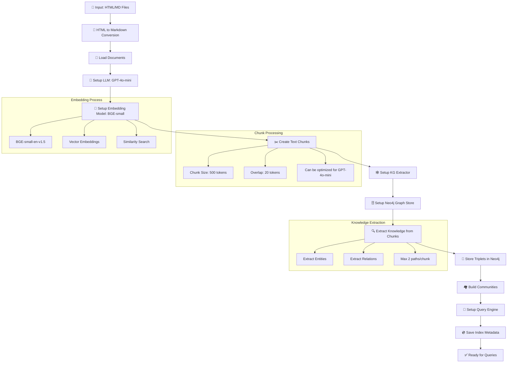
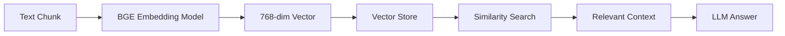

# GraphRAG Application

Một ứng dụng GraphRAG hoàn chỉnh sử dụng LlamaIndex, Neo4j và Streamlit để xây dựng và truy vấn knowledge graph từ các tài liệu markdown.

## 🏗️ Kiến trúc

Ứng dụng được chia thành 2 phần chính:

1. **`build_index.py`** - Script xây dựng index (chạy trong terminal)
2. **`app.py`** - Giao diện Streamlit để truy vấn (chạy trong browser)

## 📋 Yêu cầu hệ thống

### Dependencies
```bash
pip install streamlit llama-index neo4j openai pandas beautifulsoup4 markdownify huggingface-hub
```

### Neo4j Database
- Neo4j Community Edition hoặc Neo4j AuraDB
- Cấu hình connection trong `const.py`

### OpenAI API Key
- Cần có OpenAI API key để sử dụng GPT models
- Cấu hình trong `const.py`

## 🚀 Hướng dẫn sử dụng

### Bước 1: Chuẩn bị dữ liệu

Đặt các file HTML hoặc Markdown vào thư mục `data/`:

```
data/
├── document1.html
├── document2.md
├── article.html
└── notes.md
```

### Bước 2: Cấu hình

Cập nhật file `const.py` với thông tin của bạn:

```python
# Neo4j Configuration
NEO4J_URI = "bolt://localhost:7687"
NEO4J_USERNAME = "neo4j"
NEO4J_PASSWORD = "your_password"

# OpenAI Configuration
OPENAI_API_KEY = "your_openai_api_key"
```

### Bước 3: Xây dựng Index

Chạy script build index trong terminal:

```bash
python build_index.py
```

## 🔄 Quy trình Build Index Chi tiết



### Các bước chi tiết:

1. **🔄 HTML to Markdown Conversion** (`convert_html_to_markdown`)
   - Chuyển đổi file HTML thành Markdown
   - Sử dụng BeautifulSoup và markdownify
   - Skip files đã được convert và up-to-date

2. **📖 Load Documents** (`load_data`)
   - Tải tối đa 50 file markdown (có thể cấu hình)
   - Tạo Document objects với metadata
   - Xử lý encoding UTF-8

3. **🤖 Setup LLM** (`setup_llm`)
   - Model: **GPT-4o-mini** (128K context window)
   - Tối ưu cho cost và performance
   - Xử lý knowledge extraction

4. **🧠 Setup Embedding Model** (`setup_embedding_model`)
   - Model: **BAAI/bge-small-en-v1.5**
   - Vai trò: Tạo vector embeddings cho text chunks
   - Mục đích: Similarity search và retrieval

5. **✂️ Create Text Chunks** (`create_nodes`)
   - Chunk size: **500 tokens** (có thể tối ưu thêm cho GPT-4o-mini)
   - Overlap: **20 tokens** (đảm bảo context liên tục)
   - Sử dụng SentenceSplitter

6. **🕸️ Setup KG Extractor** (`setup_kg_extractor`)
   - Custom GraphRAGExtractor với CSV format
   - Fallback: SimpleLLMPathExtractor
   - Max 2 paths per chunk

7. **🗄️ Setup Neo4j Graph Store** (`setup_graph_store`)
   - Kết nối Neo4j database
   - Clear existing data
   - Chuẩn bị cho việc lưu trữ graph

8. **🔍 Extract Knowledge** (`build_index`)
   - Xử lý **TẤT CẢ** chunks (không giới hạn)
   - Extract entities và relationships
   - Detailed logging với màu sắc

9. **💾 Store in Neo4j**
   - Lưu entities và relationships
   - Format: (Entity)-[RELATION]->(Entity)
   - Cypher queries để insert data

10. **🏘️ Build Communities** (`build_communities`)
    - Phân tích cấu trúc community
    - Tạo summaries (nếu hỗ trợ)

## 🧠 Vai trò của EMBEDDING_MODEL

### Model: BAAI/bge-small-en-v1.5

**Embedding Model** đóng vai trò quan trọng trong hệ thống GraphRAG:

#### 🎯 Chức năng chính:
1. **Vector Representation**: Chuyển đổi text chunks thành vector embeddings
2. **Similarity Search**: Tìm kiếm chunks tương tự dựa trên semantic similarity
3. **Retrieval**: Lấy context liên quan cho câu trả lời

#### 🔍 Quy trình hoạt động:


#### ⚡ Tại sao chọn BGE-small-en-v1.5:
- **Hiệu suất cao**: Top performance trên MTEB benchmark
- **Kích thước nhỏ**: ~133MB, phù hợp cho local deployment
- **Đa ngôn ngữ**: Hỗ trợ tiếng Anh tốt
- **Open source**: Miễn phí, không cần API key

#### 🔧 Cấu hình trong code:
```python
# const.py
EMBEDDING_MODEL = "BAAI/bge-small-en-v1.5"

# build_utils.py
embed_model = HuggingFaceEmbedding(model_name=EMBEDDING_MODEL)
```

### Bước 4: Chạy ứng dụng Streamlit

Sau khi build index thành công, chạy ứng dụng Streamlit:

```bash
streamlit run app.py
```

Ứng dụng sẽ mở tại `http://localhost:8501`

## 🎛️ Cấu hình tối ưu (Đã cập nhật)

### Environment Variables

```bash
# Số lượng file markdown để xử lý (mặc định: 50)
export NUM_MARKDOWN_FILES=50

# Xử lý TẤT CẢ nodes (không giới hạn)
# NUM_NODES_TO_PROCESS không còn được sử dụng

# Kích thước chunk (có thể tối ưu cho GPT-4o-mini)
export CHUNK_SIZE=500

# Chunk overlap
export CHUNK_OVERLAP=20

# Max paths per chunk
export MAX_PATHS_PER_CHUNK=2

# Similarity top K
export SIMILARITY_TOP_K=10
```

### Cấu hình mặc định

Giá trị mặc định từ `const.py`:

- `NUM_MARKDOWN_FILES`: **50** (tăng từ 10)
- `CHUNK_SIZE`: **500** (có thể tối ưu thêm cho GPT-4o-mini)
- `CHUNK_OVERLAP`: **20**
- `MAX_PATHS_PER_CHUNK`: **2**
- `SIMILARITY_TOP_K`: 10

### 💡 Gợi ý tối ưu hóa:

Để tận dụng tốt hơn GPT-4o-mini (128K context window), bạn có thể:

1. **Tăng CHUNK_SIZE** lên 4096-8192 tokens để giảm API requests
2. **Tăng CHUNK_OVERLAP** lên 100-200 tokens để đảm bảo context liên tục
3. **Tăng MAX_PATHS_PER_CHUNK** lên 5-10 để trích xuất nhiều relationships hơn

Ví dụ cấu hình tối ưu:
```bash
export CHUNK_SIZE=4096
export CHUNK_OVERLAP=100
export MAX_PATHS_PER_CHUNK=5
```

## 📊 Giao diện Streamlit

### Tab 1: Query Interface
- **Quick Queries**: Các câu hỏi mẫu về LLM agents
- **Custom Query**: Nhập câu hỏi tùy chỉnh
- **Real-time response**: Sử dụng GraphRAG để trả lời

### Tab 2: Graph Analysis
- Thống kê về knowledge graph
- Hiển thị sample triplets
- Community summaries (nếu có)
- Neo4j connection status

### Tab 3: Data Info
- Thông tin về các file đã xử lý
- Metadata của index
- Build statistics

## 🔧 Troubleshooting

### Lỗi "No pre-built index found"
```bash
# Chạy lại build index
python build_index.py
```

### Lỗi Neo4j connection
- Kiểm tra Neo4j service đang chạy
- Kiểm tra thông tin kết nối trong `const.py`
- Kiểm tra firewall/network

### Lỗi OpenAI API
- Kiểm tra API key trong `const.py`
- Kiểm tra quota và billing
- Kiểm tra network connection

### Lỗi Embedding Model
```bash
# Download model manually nếu cần
python -c "from llama_index.embeddings.huggingface import HuggingFaceEmbedding; HuggingFaceEmbedding(model_name='BAAI/bge-small-en-v1.5')"
```

### Lỗi "No data found in Neo4j"
- Chạy lại `python build_index.py`
- Kiểm tra log để xem có lỗi trong quá trình build không

## 📁 Cấu trúc thư mục

```
.
├── app.py                      # Streamlit query interface
├── build_index.py             # Index building script (MAIN)
├── build_utils.py             # Build-specific utilities
├── utils.py                   # Shared utility functions
├── const.py                   # Configuration constants
├── graph_rag_extractor.py     # Custom KG extractor
├── graph_rag_store.py         # Custom graph store
├── graph_rag_query_engine.py  # Custom query engine
├── html_to_md_converter.py    # HTML to Markdown converter
├── data/                      # Input documents
│   ├── *.html
│   └── *.md
├── index_data/                # Generated index metadata
│   ├── index_metadata.pkl
│   └── files_df.pkl
└── README.md                  # This file
```

## 📝 Logs và Monitoring

### Build Index Logs
Script `build_index.py` sẽ hiển thị progress với timestamp và màu sắc:
```
🕸️ GraphRAG Index Builder
==================================================

📋 Configuration:
  - Number of markdown files: 50
  - Number of nodes to process: ALL (no limit)
  - Chunk size: 500 (can be optimized for GPT-4o-mini)
  - Chunk overlap: 20
  - Max paths per chunk: 2
  - Similarity top K: 10
  - Model: gpt-4o-mini (128K context window)

[14:30:15] Step 1/10: Converting HTML files to Markdown...
[14:30:16] Step 2/10: Loading markdown files...
...
[14:35:20] 🎉 GraphRAG Index Building Completed Successfully!

📊 Statistics:
  - Total triplets in graph: 1,234
  - Documents processed: 45
  - Nodes created: 156
  - Nodes processed: ALL (156)
```

### Streamlit Logs
Streamlit app sẽ hiển thị status trong sidebar và main interface.

## 🎯 Tips sử dụng

1. **Lần đầu setup**: Chạy với ít files để test (set `NUM_MARKDOWN_FILES=5`)
2. **Production**: Sử dụng cấu hình mặc định đã tối ưu
3. **Performance**: Monitor Neo4j memory usage
4. **Queries**: Bắt đầu với quick queries trước khi dùng custom queries
5. **Embedding**: Model sẽ tự download lần đầu (~133MB)

## 🔬 Technical Details

### Models Used:
- **LLM**: GPT-4o-mini (128K context, cost-effective)
- **Embedding**: BAAI/bge-small-en-v1.5 (768-dim vectors)
- **Graph DB**: Neo4j (property graph)

### Processing Pipeline:
1. **Document Processing**: HTML → Markdown → Chunks
2. **Knowledge Extraction**: LLM → Entities + Relations
3. **Graph Storage**: Neo4j → Triplets + Communities
4. **Query Processing**: Embedding → Similarity → Context → LLM

### Performance Optimizations:
- Configurable chunk size (default 500 tokens, can be increased)
- Batch processing for efficiency
- No node limits for complete indexing
- Optimized prompts for better extraction
- Potential for larger chunks with GPT-4o-mini's 128K context

## 🆘 Support

Nếu gặp vấn đề:
1. Kiểm tra logs trong terminal
2. Kiểm tra Neo4j browser tại `http://localhost:7474`
3. Kiểm tra Streamlit logs
4. Restart Neo4j service nếu cần
5. Kiểm tra disk space cho embedding model

---

**Happy GraphRAG-ing! 🕸️**


