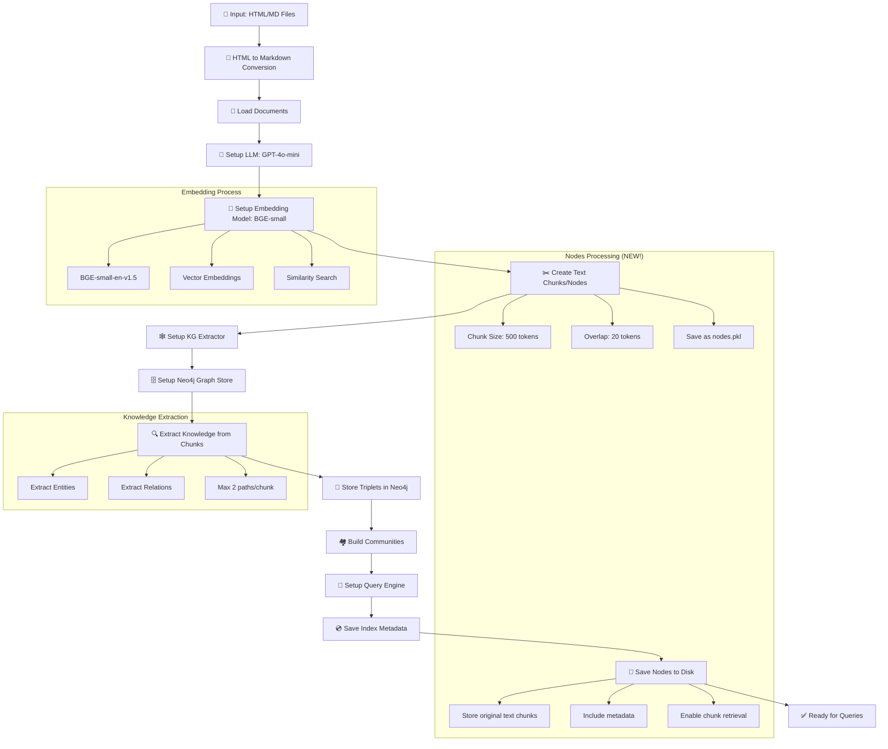
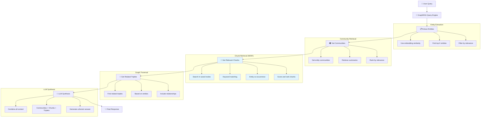
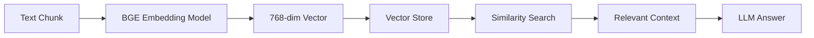

# GraphRAG Application with Nodes Integration

Một ứng dụng GraphRAG hoàn chỉnh sử dụng LlamaIndex, Neo4j và Streamlit để xây dựng và truy vấn knowledge graph từ các tài liệu markdown, **bao gồm cả nodes (chunks) gốc**.

## 🏗️ Kiến trúc

Ứng dụng được chia thành 2 phần chính:

1. **`build_index.py`** - Script xây dựng index (chạy trong terminal)
2. **`app.py`** - Giao diện Streamlit để truy vấn (chạy trong browser)

### 🆕 Tính năng mới: Nodes Integration
- **Lưu trữ nodes gốc**: Các text chunks ban đầu được lưu vào `index_data/nodes.pkl`
- **Sử dụng trong query**: Query engine có thể truy cập cả graph structure và text chunks gốc
- **Tăng độ chính xác**: Kết hợp thông tin từ entities, communities và chunks thô

## 📋 Yêu cầu hệ thống

### Dependencies
```bash
pip install streamlit llama-index neo4j openai pandas beautifulsoup4 markdownify huggingface-hub plotly networkx
```

### Neo4j Database
- Neo4j Community Edition hoặc Neo4j AuraDB
- Cấu hình connection trong `const.py`

### OpenAI API Key
- Cần có OpenAI API key để sử dụng GPT models
- Cấu hình trong `const.py`

## 🚀 Hướng dẫn sử dụng

### Bước 1: Chuẩn bị dữ liệu

Đặt các file HTML hoặc Markdown vào thư mục `data/`:

```
data/
├── document1.html
├── document2.md
├── article.html
└── notes.md
```

### Bước 2: Cấu hình

Cập nhật file `const.py` với thông tin của bạn:

```python
# Neo4j Configuration
NEO4J_URI = "bolt://localhost:7687"
NEO4J_USERNAME = "neo4j"
NEO4J_PASSWORD = "your_password"

# OpenAI Configuration
OPENAI_API_KEY = "your_openai_api_key"
```

### Bước 3: Xây dựng Index

Chạy script build index trong terminal:

```bash
python build_index.py
```

## 🔄 Quy trình Build Index Chi tiết (Updated)



### 🆕 Các bước cập nhật:

**Step 11: Save Nodes to Disk** (NEW!)
- Lưu tất cả nodes gốc vào `index_data/nodes.pkl`
- Bao gồm text content và metadata
- Cho phép query engine truy cập chunks thô

**Step 12: Load Nodes in Query** (NEW!)
- Query engine load nodes từ disk
- Sử dụng trong quá trình query
- Kết hợp với graph data

## 🔍 Quy trình Query với Nodes Integration



### 🔍 Query Processing Details:

1. **Entity Extraction**: Tìm entities liên quan đến query
2. **Community Retrieval**: Lấy summaries từ communities chứa entities
3. **🆕 Chunk Retrieval**: Tìm text chunks gốc có chứa keywords và entities
4. **Graph Traversal**: Lấy triplets liên quan
5. **LLM Synthesis**: Kết hợp tất cả thông tin để tạo response

### 🎯 Ưu điểm của Nodes Integration:

- **Độ chính xác cao hơn**: Có access đến text ngữ cảnh gốc
- **Chi tiết hơn**: Không chỉ dựa vào summaries mà còn có raw text
- **Linh hoạt**: Có thể điều chỉnh thuật toán tìm chunks
- **Debug-friendly**: Hiển thị được chunks được sử dụng

## 🧠 Vai trò của EMBEDDING_MODEL

### Model: BAAI/bge-small-en-v1.5

**Embedding Model** đóng vai trò quan trọng trong hệ thống GraphRAG:

#### 🎯 Chức năng chính:
1. **Vector Representation**: Chuyển đổi text chunks thành vector embeddings
2. **Similarity Search**: Tìm kiếm chunks tương tự dựa trên semantic similarity
3. **Retrieval**: Lấy context liên quan cho câu trả lời

#### 🔍 Quy trình hoạt động:


#### ⚡ Tại sao chọn BGE-small-en-v1.5:
- **Hiệu suất cao**: Top performance trên MTEB benchmark
- **Kích thước nhỏ**: ~133MB, phù hợp cho local deployment
- **Đa ngôn ngữ**: Hỗ trợ tiếng Anh tốt
- **Open source**: Miễn phí, không cần API key

#### 🔧 Cấu hình trong code:

### Bước 4: Chạy ứng dụng Streamlit

Sau khi build index thành công, chạy ứng dụng Streamlit:

```bash
streamlit run app.py
```

Ứng dụng sẽ mở tại `http://localhost:8501`

## 💬 Example Queries

Sau khi build index thành công, bạn có thể thử các câu hỏi mẫu sau:

### 🎯 Recommended Queries:

1. **"What are the main components of LLM-powered autonomous agents?"**
   - Tìm hiểu về các thành phần chính của LLM agents
   - Kết quả: Planning, Memory, Tool use, Action

2. **"How does planning work in LLM agents?"**
   - Khám phá cơ chế planning trong LLM agents
   - Kết quả: Task decomposition, subgoal generation, reflection

3. **"What are the different types of memory in agent systems?"**
   - Tìm hiểu về các loại memory trong hệ thống agent
   - Kết quả: Sensory memory, short-term memory, long-term memory

### 💡 Tips for Better Queries:
- Sử dụng câu hỏi cụ thể và rõ ràng
- Tập trung vào các khái niệm chính trong tài liệu
- Có thể hỏi về relationships giữa các concepts
- Thử các câu hỏi "How", "What", "Why" để có câu trả lời chi tiết


## 📊 Giao diện Streamlit (Updated)

### Tab 1: Query Interface
- **Real-time query processing**: Step-by-step progress indicator
- **Final Response**: Kết quả cuối cùng từ LLM
- **🆕 Debug Information**: 
  - Source nodes used
  - **Relevant text chunks** (from saved nodes)
  - Related triplets
  - Community information
  - Query processing details

### Tab 2: Graph Analysis
- **Triplets Graph**: Interactive visualization với Plotly
- **Communities Graph**: Community structure visualization
- Thống kê về knowledge graph
- Sample triplets và community summaries

### Sidebar Information:
- Index metadata (timestamp, files processed)
- **🆕 Nodes count**: Số lượng chunks đã lưu
- Query settings (similarity top K)

## 📁 Cấu trúc thư mục (Updated)

```
.
├── app.py                         # Streamlit query interface
├── build_index.py                 # Index building script (MAIN)
├── build_utils.py                 # Build-specific utilities
├── utils.py                       # Shared utility functions
├── const.py                       # Configuration constants
├── graph_rag_extractor.py         # Custom KG extractor
├── graph_rag_store.py             # Custom graph store
├── graph_rag_query_engine.py      # Custom query engine (Updated)
├── html_to_md_converter.py        # HTML to Markdown converter
├── data/                          # Input documents
│   ├── *.html
│   └── *.md
├── index_data/                    # Generated index metadata
│   ├── index_metadata.pkl         # Index metadata
│   ├── files_df.pkl              # Files dataframe
│   └── 🆕 nodes.pkl              # Original text chunks
├── tests/                         # Test files
│   ├── test_config.py
│   ├── test_neo4j_connection.py
│   └── 🆕 test_nodes_integration.py
└── README.md                      # This file
```
