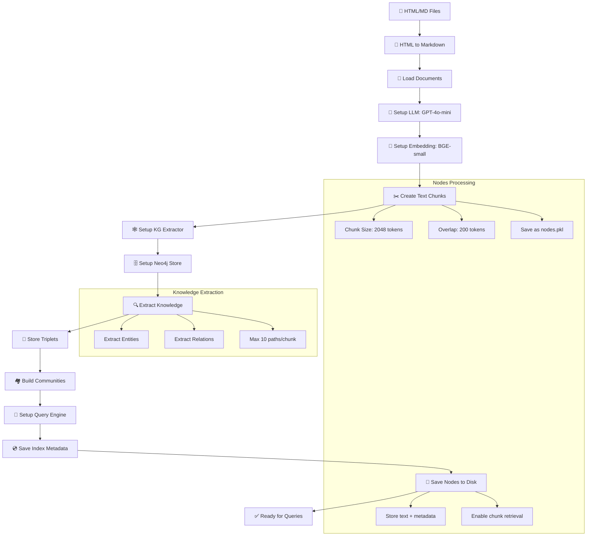
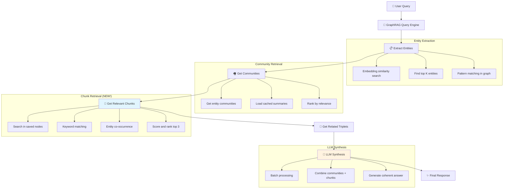
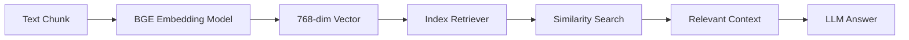

# GraphRAG Application with Nodes Integration

Một ứng dụng GraphRAG hoàn chỉnh sử dụng LlamaIndex, Neo4j và Streamlit để xây dựng và truy vấn knowledge graph từ các tài liệu HTML/Markdown, **bao gồm cả nodes (chunks) gốc**.

## 🏗️ Kiến trúc

Ứng dụng được chia thành 2 phần chính:

1. **`build_index.py`** - Script xây dựng index (chạy trong terminal)
2. **`app.py`** - Giao diện Streamlit để truy vấn (chạy trong browser)

### 🆕 Tính năng mới: Nodes Integration
- **Lưu trữ nodes gốc**: Các text chunks ban đầu được lưu vào `index_data/nodes.pkl`
- **Sử dụng trong query**: Query engine có thể truy cập cả graph structure và text chunks gốc
- **Tăng độ chính xác**: Kết hợp thông tin từ entities, communities và chunks thô

## 📋 Yêu cầu hệ thống

### Dependencies
```bash
# Cài đặt từ requirements.txt
pip install -r requirements.txt

# Hoặc sử dụng Makefile
make install
```

**Các package chính:**
xem trong file requirements.txt

### Neo4j Database
Sử dụng Docker Compose với Neo4j 5.15 Community Edition:
```bash
make neo4j-start    # Khởi động Neo4j
make neo4j-status   # Kiểm tra trạng thái
make neo4j-stop     # Dừng Neo4j
make neo4j-reset    # Reset database
```

### Cấu hình Environment Variables
Tạo file `.env` hoặc export các biến môi trường:

```bash
# Required
export OPENAI_API_KEY="your_openai_api_key"

# Optional (có default values)
export NEO4J_URI="bolt://localhost:7687"
export NEO4J_USERNAME="neo4j"
export NEO4J_PASSWORD="password"

# Build configuration
export NUM_MARKDOWN_FILES="50"
export CHUNK_SIZE="2048"
export CHUNK_OVERLAP="200"
export MAX_PATHS_PER_CHUNK="10"
export SIMILARITY_TOP_K="10"
```

## 🚀 Quick Start

1. **Chuẩn bị dữ liệu**
```bash
# Đặt files vào thư mục data/
mkdir -p data
# Copy your .html hoặc .md files vào data/
# Các file html/md trong thư mục data/ sẽ được chuyển thành markdown và được xử lý để tạo ra các text chunks
```

2. **Khởi động Neo4j**
```bash
make neo4j-start
make test-connection
```

3. **Build index**
```bash
make build-index
```

4. **Chạy Streamlit app**
```bash
make run
```

## 🔄 Quy trình Build Index Chi tiết



### 🔧 Cấu hình tối ưu:
- **Chunk Size**: 2048 tokens (tối ưu cho GPT-4o-mini với 128K context)
- **Max Paths**: 10 per chunk (tăng từ 2 để extract đầy đủ hơn)
- **Similarity Top K**: 10 (balance giữa chất lượng và performance)
- **Files Processed**: 50 (tăng từ 10 để có dataset lớn hơn)

## 🔍 Quy trình Query với Nodes Integration



### 🎯 Ưu điểm của implementation hiện tại:

- **Batch Processing**: Gom nhiều communities thành 1 LLM call để tăng hiệu quả
- **Caching**: Communities được cache trong file `community/summary.json`
- **Performance Optimization**: Giới hạn top 10 communities và top 3 chunks
- **Debug-friendly**: Hiển thị source nodes và processing steps trong UI

## 🧠 Vai trò của EMBEDDING_MODEL

### Model: BAAI/bge-small-en-v1.5

**Embedding Model** đóng vai trò quan trọng trong hệ thống GraphRAG:

#### 🎯 Chức năng chính:
1. **Vector Representation**: Chuyển đổi text chunks thành 768-dimensional vectors
2. **Similarity Search**: Tìm kiếm entities và chunks tương tự với query
3. **Retrieval**: Lấy context liên quan cho câu trả lời

#### 🔍 Quy trình hoạt động:


#### ⚡ Tại sao chọn BGE-small-en-v1.5:
- **Hiệu suất cao**: Top performance trên MTEB benchmark
- **Kích thước nhỏ**: ~133MB, phù hợp cho local deployment
- **Semantic Understanding**: Hiểu ngữ nghĩa tốt cho entity extraction
- **Open source**: Miễn phí, không cần API key

## 💬 Example Queries

Sau khi build index thành công, bạn có thể thử các câu hỏi mẫu sau trong Streamlit app:

### 🎯 Recommended Queries:

1. **"What are the main components of LLM-powered autonomous agents?"**
   - Tìm hiểu về các thành phần chính của LLM agents
   - Kết quả: Planning, Memory, Tool use, Action

2. **"How does planning work in LLM agents?"**
   - Khám phá cơ chế planning trong LLM agents
   - Kết quả: Task decomposition, subgoal generation, reflection

3. **"What are the different types of memory in agent systems?"**
   - Tìm hiểu về các loại memory trong hệ thống agent
   - Kết quả: Sensory memory, short-term memory, long-term memory

### 💡 Tips for Better Queries:
- Sử dụng câu hỏi cụ thể và rõ ràng
- Tập trung vào các khái niệm chính trong tài liệu
- Có thể hỏi về relationships giữa các concepts
- Thử các câu hỏi "How", "What", "Why" để có câu trả lời chi tiết

## 📊 Giao diện Streamlit

### 🔍 Query Interface Tab
- **Real-time Processing**: Hiển thị step-by-step progress
- **Chat History**: Lưu trữ và hiển thị lịch sử hỏi đáp
- **Debug Information**: 
  - Source nodes used trong query
  - **Relevant text chunks** từ saved nodes
  - Related triplets từ knowledge graph
  - Community information
  - Query processing details

### 📊 Graph Analysis Tab
- **Interactive Triplets Graph**: Visualization với Plotly và NetworkX
- **Communities Graph**: Community structure visualization
- **Statistics Dashboard**: Metrics về entities, relations, communities
- **Data Table**: Browse tất cả triplets với search functionality
- **Community Details**: Xem summaries của từng community

### Sidebar Information:
- **Index Metadata**: Timestamp, files processed, index type
- **Community Status**: Cache status và số lượng communities
- **Navigation Menu**: Chuyển đổi giữa các functions

## 📁 Cấu trúc thư mục

```
project/
├── Core Application Files
│   ├── app.py                         # Streamlit query interface (451 lines)
│   ├── build_index.py                 # Index building script (259 lines)
│   ├── const.py                       # Configuration constants (77 lines)
│   └── requirements.txt               # Python dependencies (28 packages)
│
├── Core Logic Modules
│   ├── graph_rag_query_engine.py      # Custom query engine (680 lines)
│   ├── graph_rag_store.py             # Neo4j graph store (350 lines)
│   ├── graph_rag_extractor.py         # Knowledge extractor (307 lines)
│   ├── utils.py                       # Shared utilities (403 lines)
│   └── build_utils.py                 # Build-specific utilities (367 lines)
│
├── Data Processing
│   ├── html_to_md_converter.py        # HTML→Markdown converter (197 lines)
│   ├── data/                          # Input documents (HTML/MD)
│   └── index_data/                    # Generated index data
│       ├── index_metadata.pkl         # Build metadata
│       ├── files_df.pkl              # Files dataframe
│       └── nodes.pkl                 # 🆕 Original text chunks
│
├── Infrastructure
│   ├── docker-compose.yml             # Neo4j setup (Neo4j 5.15)
│   ├── setup_neo4j.sh                 # Neo4j management script
│   ├── Makefile                       # Task automation (65 lines)
│   └── .streamlit/                    # Streamlit configuration
│
├── Community Data
│   └── community/                     # Community summaries cache
│       └── summary.json              # Cached community data
│
└── Testing
    └── tests/                         # Unit tests
        ├── test_config.py             # Configuration tests
        ├── test_neo4j_connection.py   # Neo4j connection tests
        └── test_nodes_integration.py  # 🆕 Nodes integration tests
```


## 🔧 Technical Implementation Details

### GraphRAGQueryEngine Features:
- **Batch Processing**: Gom nhiều communities thành 1 LLM call
- **Smart Limiting**: Top 10 communities + top 3 chunks để optimize performance
- **Entity Extraction**: Sử dụng embedding similarity và regex pattern matching
- **Chunk Integration**: Kết hợp graph data với original text chunks
- **Debug Information**: Comprehensive logging và debug output

### Graph Store Features:
- **Community Caching**: Tự động cache communities trong `community/summary.json`
- **Lazy Loading**: Load communities từ cache khi cần
- **Session State**: Cache graph store instance trong Streamlit session
- **Error Handling**: Graceful fallback khi cache corrupted

### Build Process Optimizations:
- **Increased Chunk Size**: 2048 tokens (từ 500) để tận dụng GPT-4o-mini
- **More Extraction Paths**: 10 paths per chunk (từ 2) để extract đầy đủ hơn
- **No Node Limit**: Process tất cả nodes thay vì giới hạn
- **Better Error Handling**: Continue on warnings, fail only on critical errors
