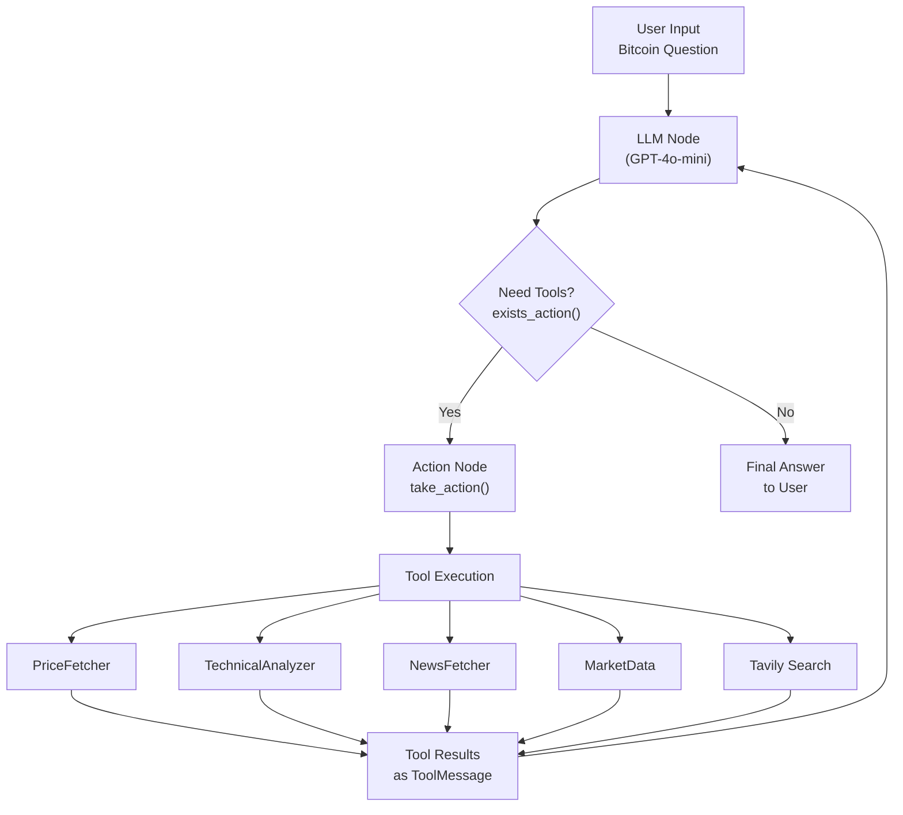

# Bitcoin Q&A System - Hệ thống Hỏi Đáp Bitcoin (LangGraph MVP)

## 📋 Tổng quan dự án

Dự án cung cấp một hệ thống hỏi đáp về Bitcoin dựa trên LangGraph agent và mô hình GPT-4o-mini. Agent sử dụng các tool chuyên biệt để truy vấn giá, phân tích kỹ thuật và cập nhật tin tức thị trường.

## 🎯 Mục tiêu MVP

1. **Agent-based Q&A**: Trả lời câu hỏi về Bitcoin qua agent LangGraph
2. **Tool Integration**: Tích hợp các tool thu thập và phân tích dữ liệu
3. **Real-time Data**: Lấy dữ liệu thị trường theo yêu cầu
4. **Technical Analysis**: Tính toán chỉ số kỹ thuật cơ bản
5. **Simple Workflow**: Agent cơ bản với LLM → Tool → Response flow

## 🏗️ Cấu trúc thư mục
```
├── agents/
│   ├── bitcoin_qa_agent.py       # Định nghĩa agent
│   ├── tools/                    # Các tool phục vụ agent
│   │   ├── price_fetcher.py      # Lấy giá Bitcoin qua yfinance
│   │   ├── technical_analyzer.py # Phân tích kỹ thuật (pandas_ta)
│   │   ├── news_fetcher.py       # Lấy tin tức RSS
│   │   └── market_data.py        # Dữ liệu thị trường từ CoinGecko
│   └── workflows/
│       └── qa_workflow.py        # Hàm chạy agent đơn giản
├── app.py                        # Chạy agent dạng CLI
├── Makefile                      # Lệnh install/test/run
├── pyproject.toml                # Định nghĩa phụ thuộc Poetry (Python 3.11)
├── poetry.lock
└── tests/                        # Unit tests cho từng tool
```

## LangGraph Agent Tools

- **PriceFetcher**: Lấy giá Bitcoin hiện tại hoặc lịch sử bằng `yfinance`
- **TechnicalAnalyzer**: Tính toán SMA và RSI sử dụng `pandas_ta`
- **NewsFetcher**: Lấy tiêu đề tin tức mới nhất qua RSS (`feedparser`)
- **MarketData**: Lấy dữ liệu thị trường cơ bản từ CoinGecko (`requests`)
- **Tavily Search**: Tool tra cứu Internet dùng trong agent mặc định

## 🔄 Luồng hoạt động Agent



## 📊 Các chỉ số kỹ thuật hỗ trợ

- **SMA** 20 phiên
- **RSI** chu kỳ 14

## Chạy thử agent

Tạo agent mặc định và đặt câu hỏi:
```bash
poetry run python app.py
```
Gõ `exit` để thoát.

## Phát triển

### Cài đặt phụ thuộc
```bash
pip install --user poetry
poetry install --no-root --with dev
```

### Kiểm thử và kiểu dữ liệu
```bash
make test       # chạy unit tests
```
