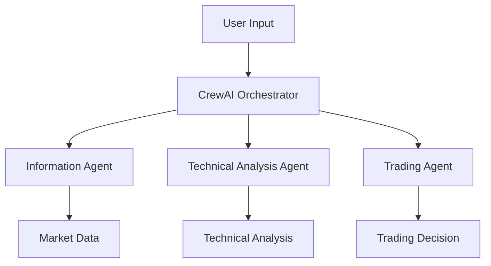

# Bitcoin Trading System - Hệ thống Giao dịch Bitcoin (CrewAI)

## 📋 Tổng quan dự án

Dự án cung cấp một hệ thống giao dịch Bitcoin đơn giản sử dụng CrewAI với 3 agent chuyên biệt. Mỗi agent có một nhiệm vụ cụ thể và làm việc cùng nhau để đưa ra quyết định giao dịch.

## 🎯 Cài đặt

```bash
pip install crewai==0.28.8 crewai_tools==0.1.6 langchain_community==0.0.29
```

## 🤖 Các Agent trong Hệ thống

### Information Agent
- Thu thập giá Bitcoin và vàng
- Cập nhật tin tức thị trường
- Sử dụng SerperDevTool để tìm kiếm thông tin

### Technical Analysis Agent
- Phân tích các chỉ số kỹ thuật cơ bản:
  - SMA (Simple Moving Average)
  - RSI (Relative Strength Index)
- Đưa ra dự báo xu hướng

### Trading Agent
- Quản lý danh mục đầu tư
- Đưa ra quyết định mua/bán dựa trên:
  - Phân tích kỹ thuật
  - Thông tin thị trường
- Xác định khối lượng giao dịch

## 📁 Cấu trúc dự án
```
├── agents/
│   ├── information_agent.py
│   ├── analysis_agent.py
│   ├── trading_agent.py
│   └── tools/
│       ├── price_fetcher.py
│       └── technical_analyzer.py
├── app.py
└── requirements.txt
```

## 🔄 Luồng hoạt động



## 🚀 Chạy thử

1. Cài đặt các thư viện cần thiết:
```bash
pip install -r requirements.txt
```

2. Chạy hệ thống:
```bash
python app.py
```
