# 🎯 AI Specialized TOEIC Speaking Tutor System - Picture Description

## 📋 Overview

The AI tutor system uses the CrewAI framework to create a specialized learning environment that helps students improve their TOEIC Speaking picture description skills from **120 to 180/200 points**. The system includes **4 specialized AI agents**, each taking on specific roles in the process of image analysis, sample writing, assessment, and comprehensive learning mentorship with error analysis and improvement recommendations.

## 🎯 System Objectives

### Main Goals
- ⬆️ **Score Enhancement**: Improve TOEIC Speaking from 120 to 180/200 points
- 🔄 **Systematic Analysis**: Scientifically improve picture description skills
- 📊 **Progress Tracking**: Detailed error analysis and improvement tracking
- ⚡ **Instant Feedback**: Specific and timely improvement guidance
- 🎯 **Personalized Learning Path**: Based on individual student weaknesses

### ✨ Key Features
- 🧠 **Intelligent Picture Analysis**: Automatic object recognition, layout analysis, and key vocabulary identification
- 🎯 **Automated Assessment**: Scoring based on official TOEIC Speaking standards
- 📈 **Error Group-Based Learning**: Categorize errors into groups and prioritize feedback for most frequent error patterns
- 💡 **Adaptive Feedback System**: Intensified coaching for frequently occurring error groups with personalized improvement strategies
- 📝 **Automatic Sample Generation**: Create sample descriptions for each picture
- 🔄 **Cross-Session Error Analytics**: Comprehensive error pattern analysis across all practice sessions
- 🏆 **Mastery-Based Progression**: Intensive practice on the same picture until achieving Band 7 (180/200) before advancing to next image

## 🏗️ Multi-Agent System Architecture

### 📊 Agent Interaction Flow

```mermaid
graph TD
    A["🖼️ TOEIC Picture Database"] --> B["🤖 Picture Analysis Agent"]
    B --> |"Image Analysis Results"| C["🤖 Sample Writing Agent"]
    C --> |"Sample Description"| H["📊 Learning Dashboard"]
    
    I["🎤 Student Audio Response"] --> D["🤖 Assessment Agent"]
    D --> |"Score & Feedback"| E["🤖 Learning Mentor Agent"]
    E --> |"Error Analysis & Enhanced Coaching"| M{"🏆 Mastery Check<br/>Band 7 (180/200)?"}
    
    M --> |"✅ Yes, next picture"| A
    M --> |"❌ No - Continue Practice"| H
    
    H --> |"Enhanced Feedback & Recommendations"| J["👨‍🎓 Student"]
    J --> |"🔄 Record Again"| I
    
    C --> |"Reference Sample"| D
    B --> |"Key Elements"| D
    
    subgraph agents ["Multi-Agent System"]
        B
        C
        D
        E
    end
    
    
    
    subgraph practice ["Practice Loop"]
        I
        H
        J
    end
    
    subgraph database ["Picture Database"]
        A
    end

    classDef agentStyle fill:#ff6600,stroke:#333,stroke-width:2px,color:#fff
    
    class B,C,D,E agentStyle
```

## 🏆 Mastery-Based Progression System

### 🎯 Single Picture Mastery Approach
The system uses a **focused mastery methodology** where students practice intensively on the **same TOEIC picture** until achieving **Band 7 (180/200 points)** before progressing to the next image from the curated database.

### 🔄 Intensive Practice Cycle

**Stage 1: Initial Assessment**
- 📊 **Baseline Scoring**: First attempt assessment to identify current level
- 🎯 **Gap Analysis**: Compare current performance with Band 7 requirements
- 📋 **Targeted Focus Areas**: Identify specific improvement needs for this picture

**Stage 2: Focused Improvement Loop**
- 💪 **Repeated Practice**: Multiple attempts on the same picture with enhanced coaching
- 📈 **Progressive Feedback**: Increasingly detailed guidance for each attempt
- 🎯 **Skill Drilling**: Intensive work on identified weak areas
- 🔍 **Micro-Improvements**: Track small but significant progress indicators

**Stage 3: Mastery Confirmation**
- ✅ **Band 7 Achievement**: Consistent scoring of 180/200 points
- 🏆 **Mastery Validation**: Multiple successful attempts to confirm stability
- 📈 **Progress Celebration**: Recognition of achievement before advancement

### 📚 Curated Picture Database Structure

**Progression Levels**:
- **Level 1**: Simple single-person activities (Band 5-6 target)
- **Level 2**: Two-person interactions (Band 6-7 target)  
- **Level 3**: Group scenarios (Band 7-8 target)
- **Level 4**: Complex workplace situations (Band 8 mastery)

**Picture Categories**:
- **Workplace Scenarios**: 20 carefully selected office/business images
- **Public Spaces**: 15 restaurant, library, transportation scenes
- **Educational Settings**: 10 classroom, laboratory, study environments
- **Social Interactions**: 15 family, friendship, community situations

### 💡 Mastery-Based Benefits
- **🏆 Deep Learning**: Complete mastery before progression ensures solid foundation
- **💪 Confidence Building**: Achieving Band 7 consistently builds speaking confidence
- **🎯 Precision Focus**: Intensive work eliminates specific weaknesses thoroughly
- **📈 Sustainable Progress**: Solid mastery prevents regression in learned skills

## 📊 Error Group-Based Learning Methodology

### 🎯 Error Classification System
The system automatically categorizes all errors into **4 main groups**:

1. **🗣️ Pronunciation Cluster**
   - Word stress patterns
   - Intonation issues
   - Sound substitutions
   - Rhythm and pacing problems

2. **📝 Grammar Patterns** 
   - Verb tense consistency
   - Subject-verb agreement
   - Article usage
   - Sentence structure errors

3. **📚 Vocabulary Gaps**
   - Inappropriate word choice
   - Limited descriptive vocabulary
   - Repetitive language use
   - Missing key TOEIC terms

4. **🏗️ Structural Issues**
   - Lack of coherent organization
   - Missing transitions
   - Incomplete descriptions
   - Time management problems

### 🔄 Adaptive Feedback Intensity

**High-Frequency Error Groups** (>60% occurrence):
- ⚡ **Intensive coaching** with detailed explanations
- 🎯 **Daily targeted exercises** 
- 📈 **Progress tracking** every 3 sessions

**Medium-Frequency Error Groups** (30-60% occurrence):
- 💡 **Regular feedback** with practical tips
- 📚 **Weekly practice recommendations**
- 📊 **Progress review** every 5 sessions

**Low-Frequency Error Groups** (<30% occurrence):
- ✅ **Maintenance feedback** 
- 🔍 **Periodic monitoring**
- 📋 **Monthly assessment**

## 🤖 Agent Details

### 🔍 Agent 1: Picture Analysis Agent (Image Analysis Specialist)

**🎯 Role**: Analyze picture layout and identify objects from curated TOEIC picture database

**📋 Responsibilities**:
- **Comprehensive Image Analysis**:
  - Analyze TOEIC picture layout and structure from pre-selected database
  - List main objects (people, objects, settings) in detail
  - Identify key vocabulary for description and target band achievement
  - Categorize picture types (indoor/outdoor, formal/informal, etc.)
- **Mastery-Focused Analysis**:
  - Provide **deep structural breakdown** for intensive practice on same image
  - Identify **multiple description angles** and approaches for the same picture
  - Extract **comprehensive vocabulary requirements** for Band 7 achievement
  - Generate **detailed coaching points** specific to the current image

**🛠️ Specialized Skills**:
- Computer Vision and Image Analysis
- TOEIC vocabulary categorization and depth analysis
- Pattern recognition for various picture types
- Spatial relationship analysis
- **Multi-Angle Analysis**: Finding different descriptive approaches for same image
- **Mastery Assessment**: Identifying completion criteria for each picture

---

### ✍️ Agent 2: Sample Writing Agent (Sample Writing Specialist)

**🎯 Role**: Create sample descriptions from picture analysis results

**📋 Responsibilities**:
- Write complete descriptions from Agent 1's information
- Use standard TOEIC Speaking structure
- Apply vocabulary and sentence structures suitable for level 150-180
- Create multiple sample versions with different difficulty levels

**🛠️ Specialized Skills**:
- TOEIC Speaking format expertise
- Academic writing and descriptive language
- Vocabulary level optimization
- Sentence structure variety

---

### 🤖 Agent 3: Assessment Agent (Audio Analysis & Scoring Specialist)

**🎯 Role**: Analyze student audio responses and generate accurate TOEIC-standard assessments

**📋 Responsibilities**:
- **Audio Processing & Analysis**:
  - Process student audio responses using integrated ASR engines
  - Generate accurate transcripts with timestamp alignment
  - Extract speech features for comprehensive analysis
- **TOEIC Scoring Implementation**:
  - Score across 4 criteria: Pronunciation, Intonation & Stress, Grammar, Vocabulary
  - Apply official TOEIC Speaking band descriptors (Level 1-8)
  - Calculate composite scores and band level determination
- **Error Detection & Annotation**:
  - Mark errors by timestamp segments for precise feedback
  - Categorize error types with specific comments
  - Generate structured JSON results for downstream processing
- **Performance Metrics**:
  - Track fluency, pace, and hesitation patterns
  - Compare with reference samples for gap analysis

**🛠️ Specialized Skills & Technical Integration**:
- **ASR Integration**: Whisper, Google STT, Azure Speech Services
- **Grammar/Vocabulary Classifiers**: ML models for common error detection
- **Pronunciation Analysis**: CMUdict, phoneme models, Azure/Speechmatics scoring APIs
- **TOEIC Scoring Algorithms**: Band-level assessment implementation
- **JSON Structured Output**: Standardized result formatting for agent communication

---

### 🤖 Agent 4: Learning Mentor Agent (Error Analytics & Personalized Coaching Specialist)

**🎯 Role**: Process Agent 3's JSON output combined with historical data to implement error group-based learning and personalized coaching strategies

**📋 Responsibilities**:
- **JSON Data Processing & Integration**:
  - Receive and parse structured JSON results from Agent 3
  - Integrate current session data with historical practice records
  - Maintain comprehensive error databases across all student sessions
- **Error Group Analysis & Classification**:
  - Consolidate errors into 4 systematic groups (Pronunciation Cluster, Grammar Patterns, Vocabulary Gaps, Structural Issues)
  - Track error frequency and patterns across multiple sessions
  - Identify dominant error patterns and prioritize by occurrence rate
  - Implement statistical analysis for trend identification
- **Frequency-Based Error Prioritization**:
  - **High-Frequency Errors** (>60%): Mark for intensive coaching intervention
  - **Medium-Frequency Errors** (30-60%): Schedule for regular practice focus
  - **Low-Frequency Errors** (<30%): Assign to maintenance monitoring
- **Personalized Learning Path Generation**:
  - Generate targeted practice recommendations for top 2-3 error categories
  - Create adaptive feedback intensity based on error persistence
  - Design progressive coaching strategies for mastery achievement
  - Synthesize comprehensive progress reports and next-step guidance

**🛠️ Specialized Skills & Technical Implementation**:
- **JSON Processing & Data Integration**: Advanced parsing and cross-session data management
- **Statistical Error Analysis**: Frequency calculation, trend analysis, pattern recognition algorithms
- **Machine Learning Classification**: Error clustering and priority scoring systems
- **Adaptive Algorithm Design**: Dynamic feedback intensity and learning path optimization
- **TOEIC Pedagogical Framework**: Evidence-based coaching strategies for systematic improvement
- **Progress Tracking Systems**: Comprehensive analytics and reporting mechanisms
- **Personalization Engines**: Individual learning path customization and optimization

## 📊 TOEIC Speaking Picture Description - Proficiency Level Standards

### Level 8
**Scale Score: 190 - 200**

Typically, test takers at level 8 can create connected, sustained discourse appropriate to the typical workplace. When they express opinions or respond to complicated requests, their speech is highly intelligible. Their use of basic and complex grammar is good and their use of vocabulary is accurate and precise.

Test takers at level 8 can also use spoken language to answer questions and give basic information.

Their pronunciation and intonation and stress are at all times highly intelligible.

### Level 7
**Scale Score: 160 - 180**

Typically, test takers at level 7 can create connected, sustained discourse appropriate to the typical workplace. They can express opinions or respond to complicated requests effectively.

In extended responses, some of the following weaknesses may sometimes occur, but they do not interfere with the message:
• minor difficulties with pronunciation, intonation or hesitation when creating language
• some errors when using complex grammatical structures
• some imprecise vocabulary

Test takers at level 7 can also use spoken language to answer questions and give basic information.

When reading aloud, test takers at level 7 are highly intelligible.

### Level 6
**Scale Score: 130 - 150**

Typically, test takers at level 6 are able to create a relevant response when asked to express an opinion or respond to a complicated request. However, at least part of the time, the reasons for, or explanations of, the opinion are unclear to a listener. This may be because of the following:
• unclear pronunciation or inappropriate intonation or stress when the speaker must create language
• mistakes in grammar
• a limited range of vocabulary

Most of the time, test takers at level 6 can answer questions and give basic information. However, sometimes their responses are difficult to understand or interpret.

When reading aloud, test takers at level 6 are intelligible.

### Level 5
**Scale Score: 110 - 120**

Typically, test takers at level 5 have limited success at expressing an opinion or responding to a complicated request. Responses include problems such as:
• language that is inaccurate, vague or repetitive
• minimal or no audience awareness
• long pauses and frequent hesitations
• limited expression of ideas and connections between ideas
• limited vocabulary

Most of the time, test takers at level 5 can answer questions and give basic information. However, sometimes their responses are difficult to understand or interpret.

When reading aloud, test takers at level 5 are generally intelligible. However, when creating language, their pronunciation, intonation and stress may be inconsistent.

### Level 4
**Scale Score: 80 - 100**

Typically, test takers at level 4 are unsuccessful when attempting to explain an opinion or respond to a complicated request. The response may be limited to a single sentence or part of a sentence. Other problems may include:
• severely limited language use
• minimal or no audience awareness
• consistent pronunciation, stress and intonation difficulties
• long pauses and frequent hesitations
• severely limited vocabulary

Most of the time, test takers at level 4 cannot answer questions or give basic information.

When reading aloud, test takers at level 4 vary in intelligibility. However, when they are creating language, speakers at level 4 usually have problems with pronunciation and intonation and stress. For more information, check the "Read Aloud Pronunciation and Intonation and Stress Ratings."

### Level 3
**Scale Score: 60 - 70**

Typically, test takers at level 3 can, with some difficulty, state an opinion, but they cannot support the opinion. Any response to a complicated request is severely limited.

Most of the time, test takers at level 3 cannot answer questions and give basic information. Typically, test takers at level 3 have insufficient vocabulary or grammar to create simple descriptions.

When reading aloud, speakers at level 3 may be difficult to understand. For more information, check the "Read Aloud Pronunciation and Intonation and Stress ratings."

### Level 2
**Scale Score: 40 - 50**

Typically, test takers at level 2 cannot state an opinion or support it. They either do not respond to complicated requests or the response is not at all relevant.

In routine social and occupational interactions such as answering questions and giving basic information, test takers at level 2 are difficult to understand.

When reading aloud, speakers at level 2 may be difficult to understand. For more information, check the "Read Aloud Pronunciation and Intonation and Stress Ratings."

### Level 1
**Scale Score: 0 - 30**

Test takers at level 1 left a significant part of the TOEIC Speaking Test unanswered. Test takers at level 1 may not have the listening or reading skills in English necessary to understand the test directions or the content of the test questions.

## 🏗️ System Architecture

### 🔧 Core Components
- **🤖 Multi-Agent Framework**: CrewAI orchestration
- **👁️ Computer Vision**: Image analysis and object detection  
- **🎤 Speech Processing**: Audio analysis and pronunciation scoring
- **🧠 Natural Language Processing**: Text analysis and error detection
- **📊 Machine Learning**: Progress tracking and predictive analytics

### 🗄️ Database Schema
- **👤 Student Profiles**: Student information and goals
- **🖼️ TOEIC Picture Database**: Curated collection of 60 professional TOEIC images organized by difficulty level
- **📚 Practice Sessions**: Storage of repeated practice attempts on same pictures
- **🔍 Error Patterns**: Tracking error types over time for mastery assessment
- **📈 Progress Tracking**: Monitoring improvement across sessions until Band 7 achievement
- **🏆 Mastery Records**: Documentation of completed pictures and advancement criteria

### 🔌 Integration Points
- **🖼️ Image Input**: Upload TOEIC pictures for analysis
- **🎵 Audio Input**: Recording student responses
- **⚡ Real-time Processing**: Instant processing and feedback
- **📊 Progress Dashboard**: Progress visualization and recommendations

---

> **💡 Note**: The system is designed to create a personalized learning experience that helps students effectively and systematically improve their TOEIC Speaking scores.